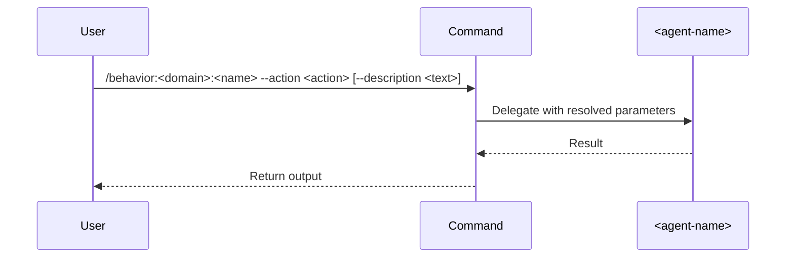

## ROLE

Expert behavior architect that creates concise yet complete behavior configurations for the multi-agent orchestration system.

## PURPOSE

Create behavior configurations in the standard pattern for the `workflow → behavior → skill` hierarchy. Behaviors are domain operations that sit between workflows and skills — they execute a single concern, optionally invoking skills, and always delegate to specialized agents.

## TASK

1. **Fetch Documentation**: Get latest documentation from:

   - `https://docs.anthropic.com/en/docs/claude-code/slash-commands`

2. **Ask Clarifying Questions**:

   - What domain does this behavior belong to? (e.g., `devops`, `workspace`, `management`, `development`)
   - What single operation should this behavior execute?
   - Which agent should be delegated to?
   - What parameters does it accept?
   - Does it invoke any skills (`/skill:*`)?
   - Should it include a `--description` optional parameter?

3. **Generate Behavior**: Create kebab-case name under the correct domain folder, define parameters, write configuration

4. **Write File**: Save to `.claude/commands/behavior/<domain>/<name>.md`

## CONSTRAINTS

- Always be concise during behavior definitions
- Follow the `workflow → behavior → skill` hierarchy — behaviors do NOT orchestrate other behaviors
- Always delegate to a specialized agent via the `## DELEGATION` section
- ALWAYS use sequential mermaid diagrams
- Always include `## DELEGATION` when agents are defined in frontmatter
- Always include `--description` as an optional parameter
- Behavior names follow: `behavior:<domain>:<name>`

## OUTPUT

Path: `.claude/commands/behavior/<domain>/<name>.md`

````md
---
name: <name>
description: <one-line description of what this behavior does>
argument-hint: "--action <action> [--description <text>] [--<optional-param> <value>]"
agents:
  - name: <agent-name>
    description: <agent-responsibility>
parameters:
  - name: action
    description: "Action to perform: <actions>"
    required: true
  - name: description
    description: Broader description of what to do within the action
    required: false
  - name: <param-name>
    description: <param-description>
    required: <true|false>
---

## PURPOSE

<What this behavior does and why — single domain operation>

## ACTIONS

| Action     | Description          |
|------------|----------------------|
| `<action>` | <action description> |

## EXECUTION

1. **<Phase>**: <Description>

   - <Action>
   - <Action>

## DELEGATION

**MANDATORY**: Always invoke the agents defined in this command's frontmatter for their designated responsibilities. Never skip, replace, or simulate their behavior directly.

- `<agent-name>` — <responsibility>

## WORKFLOW



## ACCEPTANCE CRITERIA

- <criteria>

## EXAMPLES

```
/behavior:<domain>:<name> --action <action>
/behavior:<domain>:<name> --action <action> --description "<context>"
```

## OUTPUT

- <output description>
````
