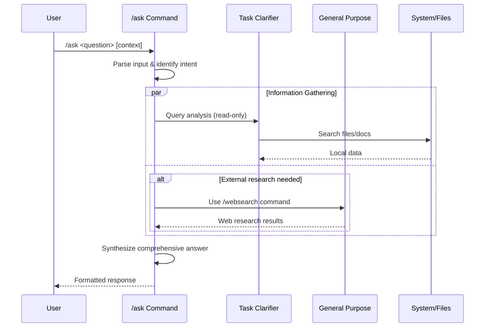

## PURPOSE

Provide intelligent question answering, clarification or query through read-only information gathering without system modifications.

## EXECUTION

1. **Query Analysis**

   - Parse the input question
   - Identify key components and intent
   - Extract context requirements
   - Identify multiple questions, queries or clarifications are asked

2. **Information Gathering**

   - Use read-only tools for data collection
   - Search relevant files and documentation
   - Gather external information if needed
   - For each employed agent use than in parallel
   - Call multiple agents in case of multiple questions or queries

3. **Response Generation**
   - Synthesize comprehensive answer from one or multiple sources
   - Provide actionable insights
   - Suggest follow-up actions

## AGENTS

ALWAYS Use specific agents defined here, select by description

- **zzaia-task-clarifier**: Agent for query analysis related to tasks in codebases
- **general-purpose**: Agent for web research and external information gathering using /websearch command

## WORKFLOW



## EXAMPLES

```bash
# General system question
/ask "How does authentication work in this system?"

# Specific technical question
/ask "What are the database migration patterns used?" context="compliance-hub"

# Architecture question
/ask "Explain the microservices communication strategy"

# Multiple questions
/ask "Explain the microservices communication strategy in this repository. Also the news about the microservice architecture"

```

## OUTPUT

- Direct, comprehensive answer to the question
- Key insights and technical details
- Practical implications and recommendations
- Related resources and references
- Suggested follow-up actions or considerations
