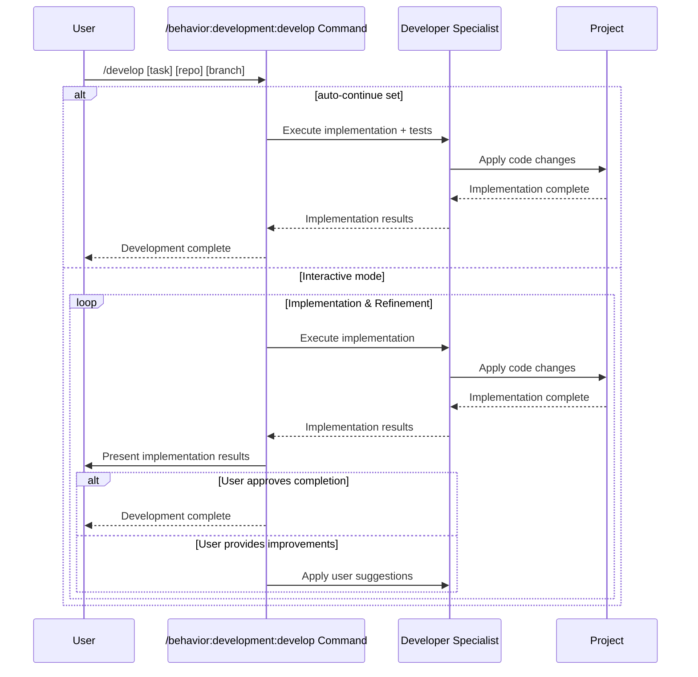

## PURPOSE

Execute focused implementation tasks for development work. Uses task specification from `/behavior:management:plan` command or assumes requirements are already clarified.

## EXECUTION

1. **Development Execution**

   - In case of not defined by the user, identify the related file or project by checking the user selected file or code lines in the IDE
   - In case of not being able to access selected file or code line, ask user which repository, branch and application to work
   - Executes implementation using zzaia-developer-specialist agent
     - Can execute multiple agents for parallel implementations

2. **Testing Development**

   - If `--auto-continue` is set, implement tests automatically as part of the implementation
   - Otherwise ask the user if tests should be implemented before proceeding

3. **Finalizing**

   - If `--auto-continue` is set, complete immediately after implementation without requesting user feedback
   - Otherwise present results, ask for improvements, and continue loop until user approves

## DELEGATION

**MANDATORY**: Always invoke the agents defined in this command's frontmatter for their designated responsibilities. Never skip, replace, or simulate their behavior directly.

- `zzaia-developer-specialist` — Implementation and development tasks with user feedback integration

## WORKFLOW



## EXAMPLES

```bash
# Plan first (recommended)
/behavior:management:plan implement user authentication system
/behavior:development:develop Add user authentication with JWT tokens repo=auth-service branch=feature/jwt-auth

# Develop in specific repository and branch
/behavior:development:develop payment processing repo=compliance-hub branch=feature/payments

```

## Acceptance Criteria

Defines when the whole process must be considered completed

- Implementation satisfies user requirements
- When `--auto-continue` is set: tests implemented automatically and workflow completes without user interaction
- When interactive: user approval granted for completion

## OUTPUT

- Implementation progress updates
- Code changes and file modifications
- Implementation completion status
- Final development completion confirmation
