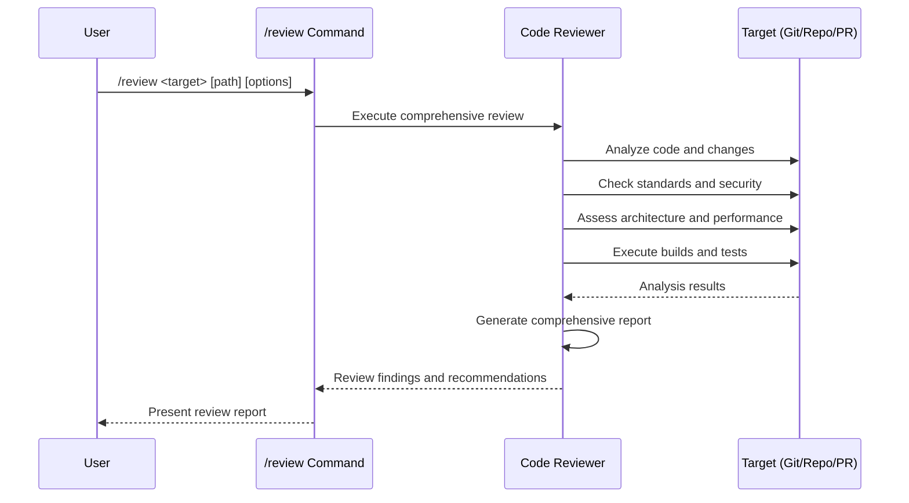

## PURPOSE

Conduct comprehensive code reviews with multi-dimensional analysis, providing actionable insights into code quality, potential improvements, and architectural considerations.

## EXAMPLES

```bash
# Review current repository changes
/review changes

# Review specific repository
/review repo /path/to/repository

# Review pull request
/review pr https://github.com/owner/repo/pull/123

# Deep review of repository
/review repo /path/to/repository --depth deep
```

## EXECUTION

1. **Initialization**

   - Validate review target and parameters
   - Prepare review environment
   - Configure review scope and depth

2. **Code Review Execution**

   - Perform comprehensive static code analysis
   - Check coding standards compliance
   - Identify potential security vulnerabilities
   - Assess performance and architectural quality
   - Execute builds and tests and retrieve errors and warnings
   - Analyze changes in broader project context
   - Review dependency interactions
   - Check for potential regression risks
   - Check for the code duplication
   - Analyze where to make the code simpler

3. **Reporting**
   - Generate detailed review report
   - Provide actionable recommendations
   - Highlight critical findings
   - Suggest potential refactoring strategies

## DELEGATION

**MANDATORY**: Always invoke the agents defined in this command's frontmatter for their designated responsibilities. Never skip, replace, or simulate their behavior directly.

- `zzaia-code-reviewer` — Comprehensive code quality review and static analysis

## WORKFLOW



## Language Rules

Apply the appropriate rule file before any code review:

**C#/.NET**: @commands/behavior/development/rules/dotnet-coding-rules.md
**Python**: @commands/behavior/development/rules/python-coding-rules.md
**Jupyter/Python Notebook**: @commands/behavior/development/rules/python-notebook-rules.md
**JavaScript/TypeScript**: @commands/behavior/development/rules/javascript-coding-rules.md
**TypeScript/Node.js**: @commands/behavior/development/rules/typescript-coding-rules.md — always TypeScript, never plain JavaScript

## ACCEPTANCE CRITERIA

- Comprehensive code quality assessment
- Detection of potential security vulnerabilities
- Actionable and clear recommendations
- Support for multiple review targets
- Consistent and standardized reporting

## OUTPUT

- Detailed markdown review report
- JSON-formatted analysis results
- Potential code improvement suggestions
- Security vulnerability report
- Architectural quality assessment
