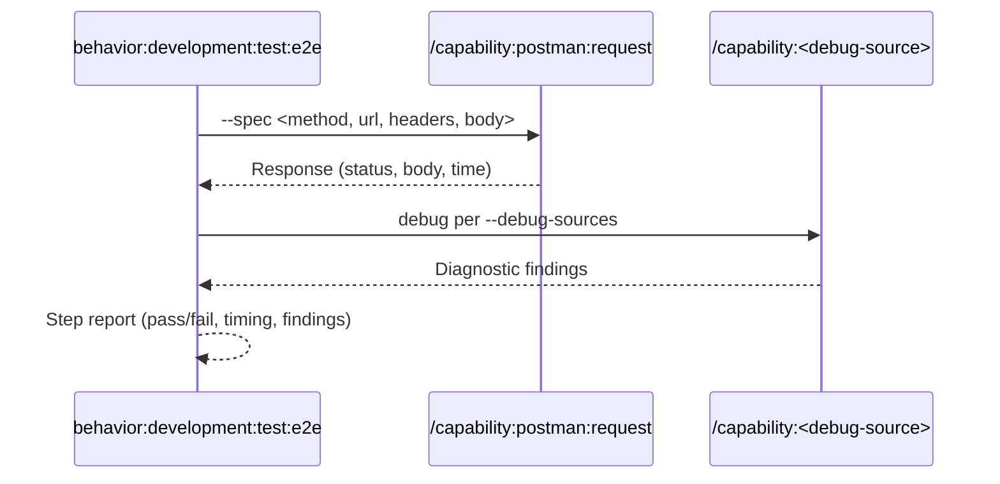

## PURPOSE

Execute a single BDD step as an HTTP call via `/capability:postman:request`, query the specified `--debug-sources` for diagnostics afterwards, and return a concise step report.

## EXECUTION

1. **Resolve Authentication**

   - Call `/behavior:workspace:ask-user-question --question "Does this API require authentication? If yes, provide the Bearer token (or leave blank to skip)"`
   - If a token is provided, include `Authorization: Bearer <token>` in all subsequent requests

2. **Execute Step**

   - Call `/capability:postman:request --spec "<method, full-url, headers, body>"` to run the HTTP call
   - Capture: response status, body, response time
   - If response is `401 Unauthorized`, call `/behavior:workspace:ask-user-question --question "Got 401 — provide a valid Bearer token to retry"` and re-execute with the new token

3. **Debug Sources** — route by `--debug-sources`:

   | Debug Source  | Capability call                                                                     |
   |---------------|-------------------------------------------------------------------------------------|
   | `new-relic`   | `/capability:new-relic:debug --application-name <application>`                      |
   | `aspire`      | `/capability:aspire:debug --application <application>`                              |
   | `sqs`         | `/capability:sqs:debug --queue-name <source>`                                       |
   | `postgresql`  | `/capability:postgresql:debug [--connection-name <application>] [--table <source>]` |
   | `docker`      | `/capability:docker:debug [--container <source>]`                                   |

4. **Report Step Result**

   - Return: step name, result (pass/fail), response time, diagnostic findings

## WORKFLOW



## ACCEPTANCE CRITERIA

- HTTP call executed via `/capability:postman:request`
- Debug source queried regardless of pass/fail result
- Step report includes: result, HTTP status, response time, diagnostic findings

## EXAMPLES

```
/behavior:development:test:e2e --step "GET /kits returns 200 with kit array" --environment https://staging-api.bloquo.io --application fiat-service --debug-sources new-relic
```

```
/behavior:development:test:e2e --step "POST /orders places message on queue" --environment https://staging.myapp.com --application order-service --debug-sources sqs --source-metadata orders-queue
```

```
/behavior:development:test:e2e --step "POST /orders persists record" --environment https://staging.myapp.com --application order-service --debug-sources postgresql --source-metadata "SELECT * FROM orders ORDER BY created_at DESC LIMIT 1"
```

## OUTPUT

- Step name and result (pass/fail)
- HTTP response status and response time
- Debug source findings: errors, anomalies, data inconsistencies, unexpected states
