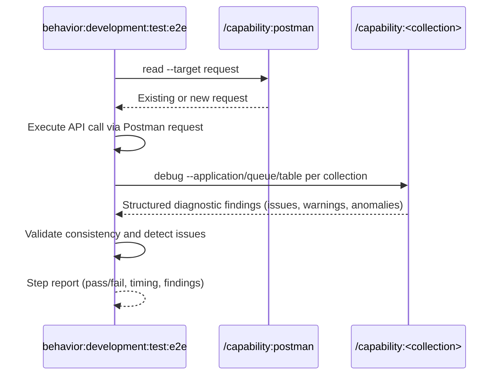

## PURPOSE

Execute a single BDD step as a direct API call against a live URL, resolve or create the Postman request, query the specified `--debug-sources` data source for consistency and issues, and return a concise step report.

## EXECUTION

1. **Resolve Postman Request**

   - Call `/capability:postman:read --target request` to find existing request matching the step URL/method
   - If not found: Call `/capability:postman:create --target request --spec "<method + url + headers + body>"`

2. **Authentication** *(if required)*

   - Call `/behavior:workspace:ask-user-question --question "Authentication required. Please provide credentials, then confirm to continue"`

3. **Execute Step**

   - Execute the API call via the resolved Postman request
   - Capture: response status, body, response time

4. **Debug Sources** — route by `--debug-sources`:

   | Debug Source  | Capability call                                                                              |
   |---------------|----------------------------------------------------------------------------------------------|
   | `new-relic`   | `/capability:new-relic:debug --application-name <application>`                               |
   | `aspire`      | `/capability:aspire:debug --application <application>`                                       |
   | `sqs`         | `/capability:sqs:debug --queue-name <source>`                                                |
   | `postgresql`  | `/capability:postgresql:debug [--connection-name <application>] [--table <source>]`          |
   | `docker`      | `/capability:docker:debug [--container <source>]`                                            |

   - Receive structured diagnostic findings from the selected source
   - Cross-reference findings with the executed step: surface errors, anomalies, warnings, or inconsistencies triggered by the API call

5. **Report Step Result**

   - Return: step name, result (pass/fail), response time, diagnostic findings (errors, anomalies, warnings, inconsistencies)

## WORKFLOW



## ACCEPTANCE CRITERIA

- Postman request resolved or created before execution
- API call executed and response captured
- Collection debugged regardless of pass/fail
- Issues, anomalies, warnings, and inconsistencies surfaced in step report
- Concise step report returned with result, timing, and findings

## EXAMPLES

```
/behavior:development:test:e2e --step "POST /orders with valid payload returns 201" --environment https://staging.myapp.com --application order-service --debug-sources new-relic
```

```
/behavior:development:test:e2e --step "POST /orders places message on queue" --environment https://staging.myapp.com --application order-service --debug-sources sqs --source orders-queue
```

```
/behavior:development:test:e2e --step "POST /orders persists record" --environment https://staging.myapp.com --application order-service --debug-sources postgresql --source "SELECT * FROM orders ORDER BY created_at DESC LIMIT 1"
```

```
/behavior:development:test:e2e --step "POST /orders returns 201" --environment https://staging.myapp.com --application order-service --debug-sources aspire
```

```
/behavior:development:test:e2e --step "POST /orders triggers container processing" --environment https://staging.myapp.com --application order-service --debug-sources docker --source order-worker
```

## OUTPUT

- Step name and result (pass/fail)
- HTTP response status and response time
- Collection findings: errors, anomalies, data inconsistencies, unexpected states
