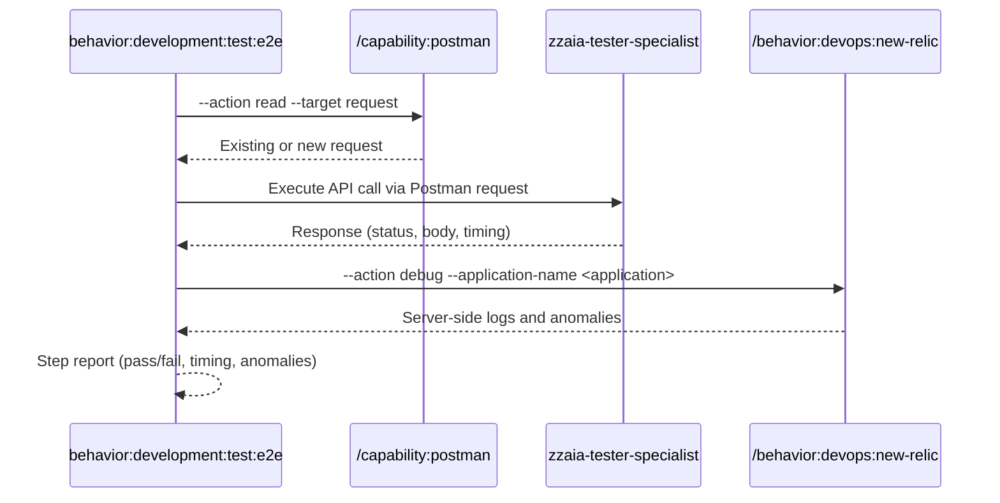

## PURPOSE

Execute a single BDD step as a direct API call against a live URL, resolve or create the Postman request, collect New Relic diagnostics, and return a concise step report.

## EXECUTION

1. **Resolve Postman Request**

   - Call `/capability:postman:read --target request` to find existing request matching the step URL/method
   - If not found: Call `/capability:postman:create --target request --spec "<method + url + headers + body>"`

2. **Authentication** *(if required)*

   - Call `/behavior:workspace:ask-user-question --question "Authentication required. Please provide credentials, then confirm to continue"`

3. **Execute Step**

   - Execute the API call via the resolved Postman request
   - Capture: response status, body, response time

4. **Collect Diagnostics**

   - Call `/behavior:devops:new-relic --action debug --application-name <application>`
   - Capture server-side logs, errors, and anomalies

5. **Report Step Result**

   - Return: step name, result (pass/fail), response time, anomalies or warnings

## DELEGATION

**MANDATORY**: Always invoke the agents defined in this command's frontmatter for their designated responsibilities. Never skip, replace, or simulate their behavior directly.

- `zzaia-tester-specialist` — Execute API step and collect diagnostics
- `zzaia-workspace-manager` — Resolve and create Postman requests

## WORKFLOW



## ACCEPTANCE CRITERIA

- Postman request resolved or created before execution
- API call executed and response captured
- New Relic diagnostics collected regardless of pass/fail
- Concise step report returned with result, timing, and anomalies

## EXAMPLES

```
/behavior:development:test --type e2e --step "POST /orders with valid payload returns 201" --environment https://staging.myapp.com --application MyApp
```

## OUTPUT

- Step name and result (pass/fail)
- HTTP response status and response time
- Server-side anomalies from New Relic
- Warnings or errors found
