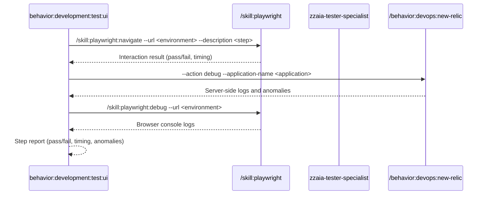

## PURPOSE

Execute a single BDD step as a browser interaction via Playwright, collect New Relic and browser console diagnostics, and return a concise step report.

## EXECUTION

1. **Authentication** *(if required)*

   - Call `/behavior:workspace:ask-user-question --question "Authentication required. Please perform manual login in the Playwright session, then confirm to continue"`

2. **Execute Step**

   - Call `/skill:playwright:navigate --url <environment> --description "<step>"`
   - Capture: interaction result, screenshot on failure, execution time

3. **Collect Diagnostics**

   - Call `/behavior:devops:new-relic --action debug --application-name <application>` for server-side logs
   - Call `/skill:playwright:debug --url <environment>` for browser console logs

4. **Report Step Result**

   - Return: step name, result (pass/fail), execution time, browser and server anomalies

## DELEGATION

**MANDATORY**: Always invoke the agents defined in this command's frontmatter for their designated responsibilities. Never skip, replace, or simulate their behavior directly.

- `zzaia-tester-specialist` — Execute browser step and collect diagnostics
- `zzaia-workspace-manager` — Manage Playwright browser session

## WORKFLOW



## ACCEPTANCE CRITERIA

- Browser step executed via Playwright
- New Relic diagnostics collected regardless of pass/fail
- Browser console logs captured regardless of pass/fail
- Concise step report returned with result, timing, and anomalies

## EXAMPLES

```
/behavior:development:test --type ui --step "User clicks checkout button and sees confirmation page" --environment https://staging.myapp.com --application MyApp
```

## OUTPUT

- Step name and result (pass/fail)
- Execution time
- Browser console errors and warnings
- Server-side anomalies from New Relic
