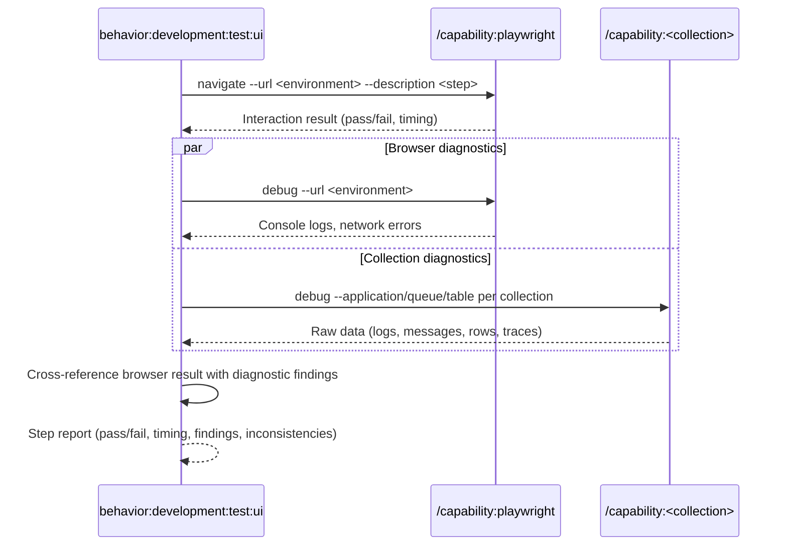

## PURPOSE

Execute a single BDD step as a browser interaction via Playwright, collect browser console diagnostics, query the specified `--debug-sources` data source for consistency and issues, and return a concise step report.

## EXECUTION

1. **Authentication** *(if required)*

   - Call `/behavior:workspace:ask-user-question --question "Authentication required. Please perform manual login in the Playwright session, then confirm to continue"`

2. **Execute Step**

   - Call `/capability:playwright:navigate --url <environment> --description "<step>"`
   - Capture: interaction result, screenshot on failure, execution time

3. **Collect Diagnostics** — run both in parallel:

   - **Browser**: Call `/capability:playwright:debug --url <environment>` for console logs and network errors
   - **Debug Sources**: route by `--debug-sources`:

   | Debug Source  | Capability call                                                                              |
   |---------------|----------------------------------------------------------------------------------------------|
   | `new-relic`   | `/capability:new-relic:debug --application-name <application>`                               |
   | `aspire`      | `/capability:aspire:debug --application <application>`                                       |
   | `sqs`         | `/capability:sqs:debug --queue-name <source>`                                                |
   | `postgresql`  | `/capability:postgresql:debug [--connection-name <application>] [--table <source>]`          |
   | `docker`      | `/capability:docker:debug [--container <source>]`                                            |

   - Cross-reference diagnostic findings with the browser interaction result — surface backend errors, failed traces, stuck messages, lock contention, or data anomalies triggered by the UI step

4. **Report Step Result**

   - Return: step name, result (pass/fail), execution time, browser findings, collection findings, cross-source inconsistencies

## WORKFLOW



## ACCEPTANCE CRITERIA

- Browser step executed via Playwright
- Browser console logs captured regardless of pass/fail
- Collection queried regardless of pass/fail
- Cross-source consistency validated between browser interaction and backend data
- Concise step report returned with result, timing, and all findings

## EXAMPLES

```
/behavior:development:test:ui --step "User clicks checkout and sees confirmation" --environment https://staging.myapp.com --application order-service --debug-sources new-relic
```

```
/behavior:development:test:ui --step "User submits order form" --environment https://staging.myapp.com --application order-service --debug-sources sqs --source orders-queue
```

```
/behavior:development:test:ui --step "User updates profile and sees success message" --environment https://staging.myapp.com --application user-service --debug-sources postgresql --source "SELECT * FROM users WHERE updated_at > NOW() - INTERVAL '1 minute'"
```

```
/behavior:development:test:ui --step "User navigates to dashboard" --environment https://staging.myapp.com --application frontend --debug-sources aspire
```

```
/behavior:development:test:ui --step "User uploads file and sees processing indicator" --environment https://staging.myapp.com --application frontend --debug-sources docker --source file-processor
```

## OUTPUT

- Step name and result (pass/fail)
- Execution time
- Browser console errors, warnings, and network failures
- Collection findings: errors, anomalies, data inconsistencies, unexpected states
- Cross-source inconsistencies between browser result and backend data
