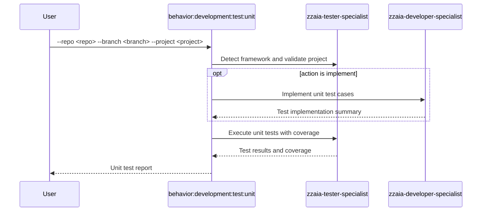

## PURPOSE

Auto-detect the testing framework and run unit tests for a specific project within a repository.

## EXECUTION

1. **Project Validation**

   - Verify repository and branch exist in workspace
   - Validate project structure and locate test files
   - Check for test configurations

2. **Framework Detection**

   - Automatically detect unit testing framework
   - Determine build requirements

3. **Implement Test Cases** *(skip if `--action run`)*

   - Use `zzaia-developer-specialist` to write unit test cases
   - Can run multiple agents in parallel per project

4. **Test Execution**

   - Execute build process if required
   - Run unit tests only
   - Execute with coverage analysis
   - Skip if no unit tests found
   - Use `zzaia-tester-specialist` for execution

## DELEGATION

**MANDATORY**: Always invoke the agents defined in this command's frontmatter for their designated responsibilities. Never skip, replace, or simulate their behavior directly.

- `zzaia-tester-specialist` — Framework detection and unit test execution
- `zzaia-developer-specialist` — Test implementation when `--action implement`

## WORKFLOW



## ACCEPTANCE CRITERIA

- Framework auto-detected from project structure
- Build executed before test run when required
- Only unit tests executed
- Coverage report generated

## EXAMPLES

```
/behavior:development:test --type unit --repo backend-hub --branch master --project api
/behavior:development:test --type unit --repo compliance-hub --branch feature/new-module --project core --action implement
```

## OUTPUT

- Build success/failure status
- List of executed unit tests with pass/fail
- Coverage percentage
- Framework detection result
- Errors and warnings on failure
