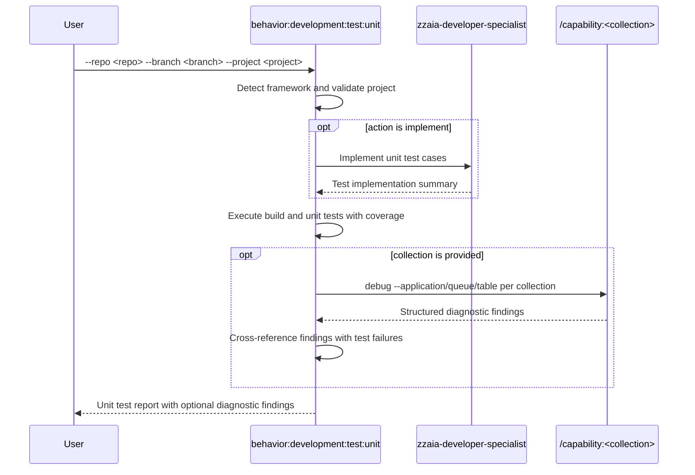

## PURPOSE

Auto-detect the testing framework, run unit tests for a specific project, and optionally debug the system via a data source collection to surface issues and inconsistencies exposed by the test run.

## EXECUTION

1. **Project Validation**

   - Verify repository and branch exist in workspace
   - Validate project structure and locate test files
   - Check for test configurations

2. **Framework Detection**

   - Automatically detect unit testing framework
   - Determine build requirements

3. **Implement Test Cases** *(skip if `--action run`)*

   - Use `zzaia-developer-specialist` to write unit test cases
   - Can run multiple agents in parallel per project

4. **Test Execution**

   - Execute build process if required
   - Run unit tests only with coverage analysis
   - Skip if no unit tests found

5. **Debug Sources** *(skip if `--debug-sources` not provided)*

   Route by `--debug-sources` after test run completes:

   | Debug Source  | Capability call                                                                              |
   |---------------|----------------------------------------------------------------------------------------------|
   | `new-relic`   | `/capability:new-relic:debug --application-name <application>`                               |
   | `aspire`      | `/capability:aspire:debug --application <application>`                                       |
   | `sqs`         | `/capability:sqs:debug --queue-name <source>`                                                |
   | `postgresql`  | `/capability:postgresql:debug [--connection-name <application>] [--table <source>]`          |
   | `docker`      | `/capability:docker:debug [--container <source>]`                                            |

   - Cross-reference diagnostic findings with test results — surface system issues, warnings, and inconsistencies revealed by the test run


## WORKFLOW



## ACCEPTANCE CRITERIA

- Framework auto-detected from project structure
- Build executed before test run when required
- Only unit tests executed with coverage report
- When `--debug-sources` provided: debug executed after test run regardless of pass/fail
- Diagnostic findings cross-referenced with test results

## EXAMPLES

```
/behavior:development:test:unit --repo backend-hub --branch master --project api
/behavior:development:test:unit --repo compliance-hub --branch feature/new-module --project core --action implement
/behavior:development:test:unit --repo order-service --branch master --project api --debug-sources postgresql --source orders
/behavior:development:test:unit --repo payment-service --branch master --project worker --debug-sources new-relic --application payment-service
/behavior:development:test:unit --repo order-service --branch master --project api --debug-sources docker --source order-service-api
```

## OUTPUT

- Build success/failure status
- List of executed unit tests with pass/fail
- Coverage percentage
- Framework detection result
- Errors and warnings on failure
- *(when `--debug-sources` set)* Diagnostic findings: issues, warnings, anomalies, and inconsistencies cross-referenced with test results
