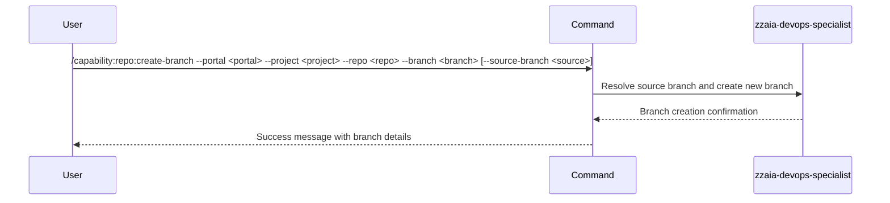

## PURPOSE

Create a new branch in a repository, optionally from a specified source branch. If no source branch is provided, creates from the repository's default branch.

## EXECUTION

1. **Validate inputs**: Confirm portal, project, repo, and branch parameters are provided

2. **Resolve source**: Determine source branch
   - If `--source-branch` provided, use it
   - Otherwise, query repository default branch

3. **Create branch**: Call appropriate portal API or CLI tool
   - Azure DevOps: Use `mcp__azure-devops__repo_*` tools to create branch
   - GitHub: Use `gh` CLI to create branch

4. **Verify creation**: Confirm branch was created successfully

5. **Return result**: Display confirmation with branch details

## DELEGATION

**MANDATORY**: Always invoke the agents defined in this command's frontmatter for their designated responsibilities. Never skip, replace, or simulate their behavior directly.

- `zzaia-devops-specialist` — Create branch via portal APIs and verify creation

## WORKFLOW



## ACCEPTANCE CRITERIA

- Source branch is correctly resolved (default or specified)
- New branch created successfully in remote repository
- Branch name follows repository naming conventions
- Error handling for branch already exists
- Error handling for invalid source branch
- Confirmation includes new branch name and source

## EXAMPLES

```
/capability:repo:create-branch --portal azure --project MyOrg --repo MyRepo --branch feature/new-feature
/capability:repo:create-branch --portal github --project my-org --repo my-repo --branch feature/new-feature --source-branch develop
/capability:repo:create-branch --portal azure --project MyOrg --repo MyRepo --branch bugfix/issue-123 --source-branch release/v1.0
```

## OUTPUT

Confirmation message including:
- New branch name created
- Source branch used
- Commit hash at branch point
- Remote URL for branch
- Success or error status
