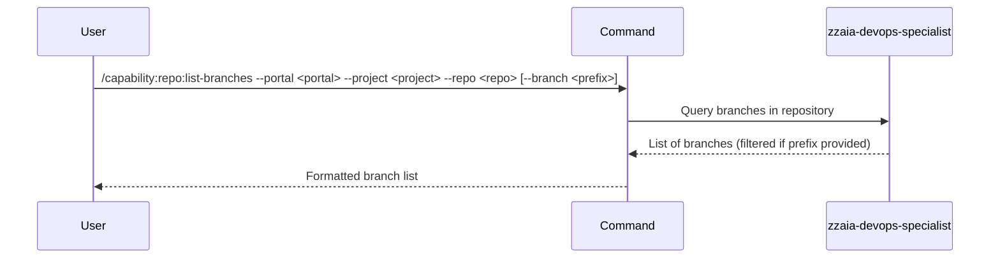

## PURPOSE

Retrieve and display all branches in a repository, with optional filtering by branch name prefix.

## EXECUTION

1. **Validate inputs**: Confirm portal, project, and repo parameters are provided

2. **Fetch branches**: Call appropriate portal API or CLI tool
   - Azure DevOps: Use `mcp__azure-devops__repo_*` tools to list branches
   - GitHub: Use `gh` CLI to list repository branches

3. **Filter branches**: If `--branch` prefix provided, filter branch list

4. **Parse response**: Extract branch names and metadata

5. **Return result**: Display filtered branch list

## DELEGATION

**MANDATORY**: Always invoke the agents defined in this command's frontmatter for their designated responsibilities. Never skip, replace, or simulate their behavior directly.

- `zzaia-devops-specialist` — Query portal APIs and filter branches

## WORKFLOW



## ACCEPTANCE CRITERIA

- All branches retrieved from repository
- Prefix filter works correctly when provided
- Branch names clearly displayed
- Default branch marked if identifiable
- Graceful handling of empty branch lists

## EXAMPLES

```
/capability:repo:list-branches --portal azure --project MyOrg --repo MyRepo
/capability:repo:list-branches --portal github --project my-org --repo my-repo --branch feature/
/capability:repo:list-branches --portal azure --project MyOrg --repo MyRepo --branch hotfix/
```

## OUTPUT

List of branches with metadata:
- Branch name
- Last commit hash (abbreviated)
- Last commit message (if available)
- Last updated timestamp (if available)
- Mark indicating default branch
