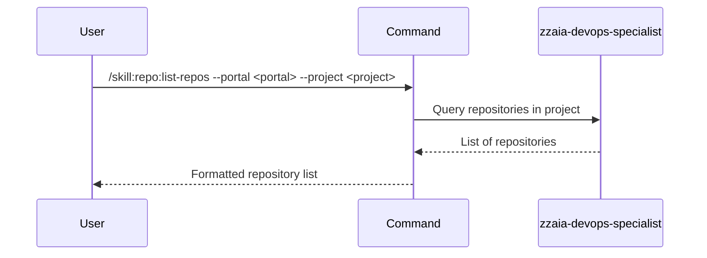

## PURPOSE

Retrieve and display a list of all repositories within a specified project or organization across Azure DevOps or GitHub.

## EXECUTION

1. **Validate inputs**: Confirm portal and project parameters are provided

2. **Fetch repositories**: Call appropriate portal API or CLI tool
   - Azure DevOps: Use `mcp__azure-devops__repo_*` tools to list project repos
   - GitHub: Use `gh` CLI to list organization repositories

3. **Parse response**: Extract repository names and metadata

4. **Return result**: Display list of repositories

## DELEGATION

**MANDATORY**: Always invoke the agents defined in this command's frontmatter for their designated responsibilities. Never skip, replace, or simulate their behavior directly.

- `zzaia-devops-specialist` — Query portal APIs and enumerate repositories

## WORKFLOW



## ACCEPTANCE CRITERIA

- All repositories in the project are listed
- Repository names are clearly displayed
- List includes basic repository metadata (if available)
- Graceful handling of empty projects

## EXAMPLES

```
/skill:repo:list-repos --portal azure --project MyOrg
/skill:repo:list-repos --portal github --project my-org
```

## OUTPUT

List of repositories with names and relevant metadata:
- Repository name
- URL
- Default branch (if available)
- Last updated timestamp (if available)
