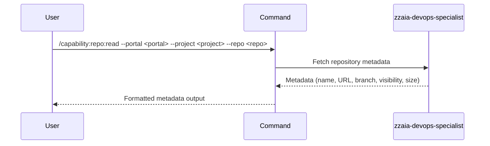

## PURPOSE

Retrieve detailed metadata about a repository including name, URL, default branch, visibility status, and total size.

## EXECUTION

1. **Validate inputs**: Confirm portal, project, and repo parameters are provided

2. **Fetch metadata**: Call appropriate portal API or CLI tool
   - Azure DevOps: Use `mcp__azure-devops__repo_*` tools
   - GitHub: Use `gh` CLI with repo show commands

3. **Parse response**: Extract metadata fields

4. **Return result**: Display metadata to user

## DELEGATION

**MANDATORY**: Always invoke the agents defined in this command's frontmatter for their designated responsibilities. Never skip, replace, or simulate their behavior directly.

- `zzaia-devops-specialist` — Retrieve and interpret repository metadata from portal APIs

## WORKFLOW



## ACCEPTANCE CRITERIA

- Metadata retrieved successfully from the specified portal
- All fields (name, URL, default branch, visibility, size) are displayed
- Graceful error handling for missing or invalid repository

## EXAMPLES

```
/capability:repo:read --portal azure --project MyOrg --repo MyRepo
/capability:repo:read --portal github --project my-org --repo my-repo
```

## OUTPUT

Structured metadata display:
- Repository name
- URL (HTTPS clone URL)
- Default branch
- Visibility (public/private)
- Total size in MB
