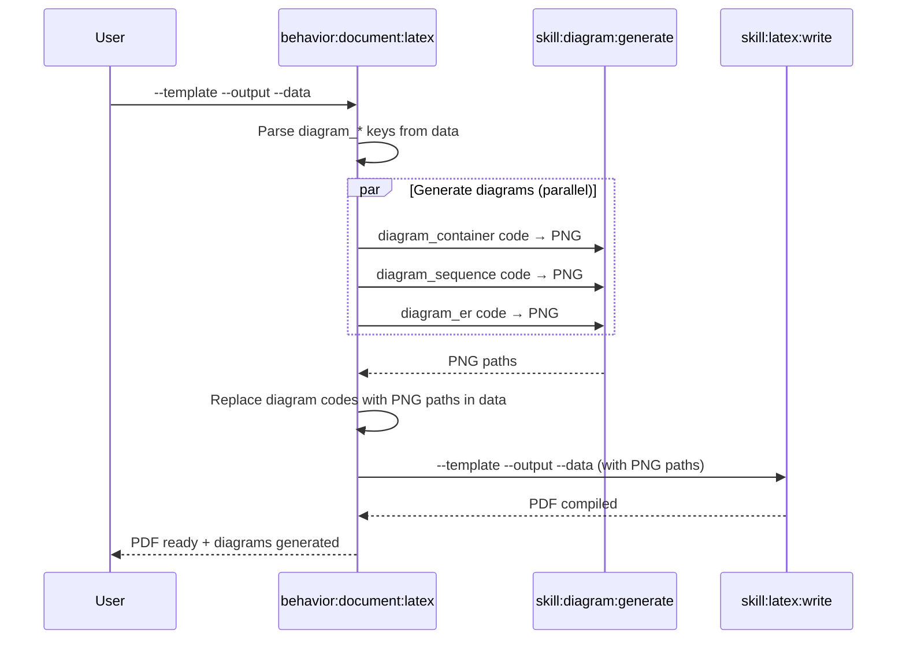

## PURPOSE

Orchestrate full LaTeX PDF generation: detect diagram code in template data, generate PNGs via `skill:diagram:generate`, then compile the PDF via `skill:latex:write`.

## EXECUTION

1. **Parse Data**: Extract `--data` JSON and identify `diagram_*` keys

2. **Generate Diagrams**: For each `diagram_*` key whose value is Mermaid or Graphviz source code
   - Invoke `@skill:diagram:generate` with the code and output path
   - Replace the value in data with the generated PNG path
   - Diagrams are saved to `--diagrams-dir` (default: `<output_dir>/diagrams/`)

3. **Compile PDF**: Invoke `@skill:latex:write` with the resolved data (diagram keys now contain PNG paths)

4. **Report**: Confirm PDF path and list diagrams generated

## MERMAID DETECTION

A `diagram_*` value is treated as diagram code (not a path) when it:
- Starts with a Mermaid keyword: `graph`, `flowchart`, `sequenceDiagram`, `classDiagram`, `stateDiagram`, `erDiagram`, `gantt`, `C4Context`, `C4Container`, `mindmap`, `gitgraph`, `timeline`, etc.
- Starts with a Graphviz keyword: `digraph`, `graph {`, `strict digraph`

A value is treated as a pre-existing path when it ends with `.png`, `.pdf`, `.jpg`, `.svg` or starts with `/`, `./`, `~/`.

## DELEGATION

- `@skill:diagram:generate` — Render each diagram code to PNG (run in parallel for multiple diagrams)
- `@skill:latex:write` — Compile LaTeX template to PDF after diagrams are ready

## WORKFLOW



## EXAMPLES

```
# Architecture doc with auto-generated C4 diagrams
/behavior:document:latex \
  --template architecture-overview \
  --output ./docs/architecture.pdf \
  --data '{"project_name":"MySystem","diagram_context":"C4Context\n  Person(u,\"User\")\n  System(s,\"System\")\n  Rel(u,s,\"Uses\")","diagram_container":"C4Container\n  Container(api,\"API\",\"ASP.NET\")\n  Container(db,\"DB\",\"PostgreSQL\")\n  Rel(api,db,\"Reads\")"}'

# Service architecture with sequence diagram
/behavior:document:latex \
  --template service-architecture \
  --output ./docs/service.pdf \
  --data '{"service_name":"OrderService","diagram_sequence":"sequenceDiagram\n  Client->>API: POST /order\n  API->>DB: Insert\n  DB-->>API: OK\n  API-->>Client: 201"}'

# With pre-existing diagram images (no generation needed)
/behavior:document:latex \
  --template service-data-model \
  --output ./docs/model.pdf \
  --data '{"service_name":"Payment","diagram_er":"./diagrams/er.png"}'
```

## OUTPUT

- PDF file at `--output` path
- List of diagrams generated with paths
- Compilation status
