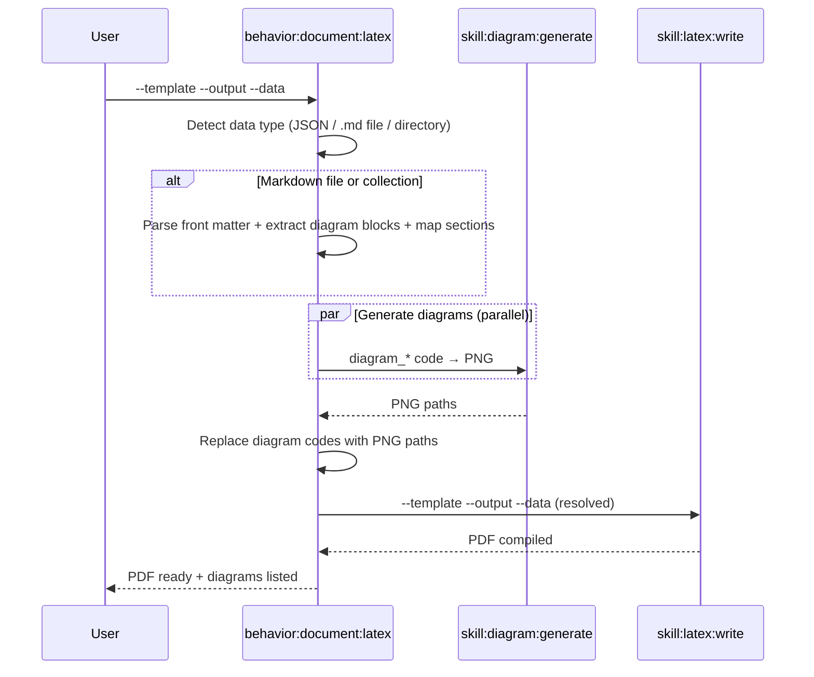
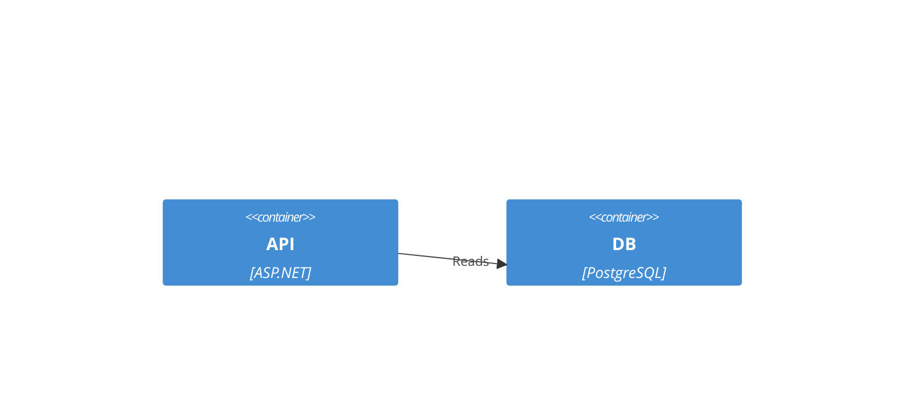
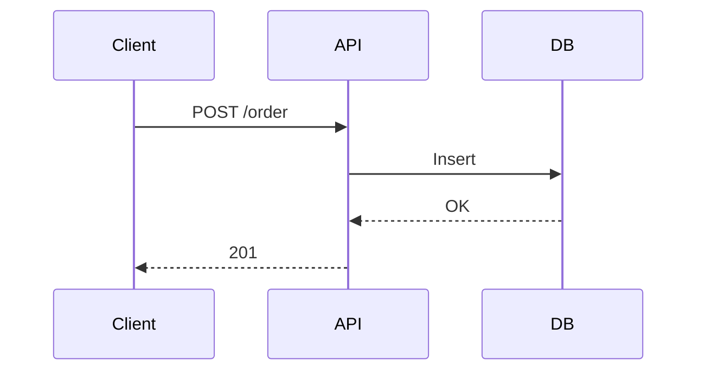

## PURPOSE

Orchestrate full LaTeX PDF generation: load data from JSON, a markdown file, or a collection of markdown files — extract Mermaid/Graphviz diagram blocks, generate PNGs via `skill:diagram:generate`, then compile the PDF via `skill:latex:write`.

## EXECUTION

### Step 1 — Resolve Data Source

Detect the `--data` input type and load template variables accordingly:

| `--data` value | Type | Action |
|---|---|---|
| Starts with `{` | JSON string | Parse directly as template variables |
| Path to a `.md` file | Markdown file | Read file → extract variables and Mermaid blocks |
| Path to a directory | Collection | Read all `.md` files → merge content into template variables |
| Omitted | None | Use empty data, rely on template defaults |

### Step 2 — Extract from Markdown (when --data is a file or directory)

When loading from markdown:
1. **Parse front matter** (YAML between `---` delimiters) as template variables
2. **Extract named Mermaid/Graphviz blocks** — fenced code blocks tagged with a diagram key:
   ````
   ```mermaid diagram_container
   C4Container
     Container(api, "API")
   ```
   ````
   → stored as `diagram_container` in template data
3. **Extract unnamed Mermaid blocks** — indexed as `diagram_1`, `diagram_2`, etc.
4. **Map section headings to template fields** — e.g. `## Overview` → `overview`, `## Core Responsibilities` → `core_responsibilities`
5. **For collections** (directory): merge all files — later files override earlier ones for the same key; diagrams are indexed by filename prefix + block index

### Step 3 — Generate Diagrams

For each `diagram_*` key whose value is Mermaid or Graphviz source code:
- Invoke `@skill:diagram:generate` in parallel
- Replace value with generated PNG path
- Save PNGs to `--diagrams-dir` (default: `<output_dir>/diagrams/`)

A value is diagram code when it starts with a Mermaid keyword (`graph`, `flowchart`, `sequenceDiagram`, `C4Context`, `C4Container`, `erDiagram`, `mindmap`, `gitgraph`, etc.) or Graphviz keyword (`digraph`, `graph {`).

A value is a pre-existing path when it ends with `.png`, `.pdf`, `.svg` or starts with `/`, `./`, `~/`.

### Step 4 — Compile PDF

Invoke `@skill:latex:write` with resolved data (all `diagram_*` keys now contain PNG paths).

### Step 5 — Report

Confirm PDF path, list diagrams generated, report any skipped placeholders.

## DELEGATION

- `@skill:diagram:generate` — Render diagram code to PNG (parallel for multiple diagrams)
- `@skill:latex:write` — Compile LaTeX template to PDF

## WORKFLOW



## EXAMPLES

```
# From JSON data
/behavior:document:latex \
  --template architecture-overview \
  --output ./docs/architecture.pdf \
  --data '{"project_name":"MySystem","diagram_context":"C4Context\n  Person(u,\"User\")\n  System(s,\"System\")\n  Rel(u,s,\"Uses\")"}'

# From a single markdown file (front matter + mermaid blocks extracted)
/behavior:document:latex \
  --template service-architecture \
  --output ./docs/service.pdf \
  --data ./docs/service-architecture.md

# From a collection directory (all .md files merged)
/behavior:document:latex \
  --template architecture-overview \
  --output ./docs/full-architecture.pdf \
  --data ./docs/architecture/

# With pre-existing diagram images
/behavior:document:latex \
  --template service-data-model \
  --output ./docs/model.pdf \
  --data '{"service_name":"Payment","diagram_er":"./diagrams/er.png"}'
```

### Markdown File Format

```markdown
---
service_name: OrderService
author: Team
date: 2026-03-26
---

## Overview
Brief service description here.

## Core Responsibilities
Handles order lifecycle management.




```

## OUTPUT

- PDF file at `--output` path
- List of diagrams generated (name → PNG path)
- Skipped placeholders (diagram_* keys without code or path)
- Compilation status
