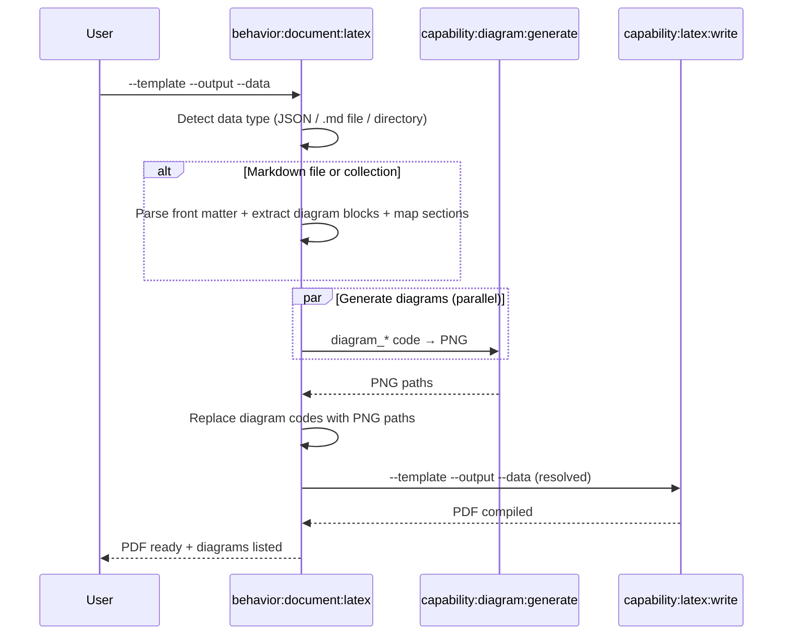
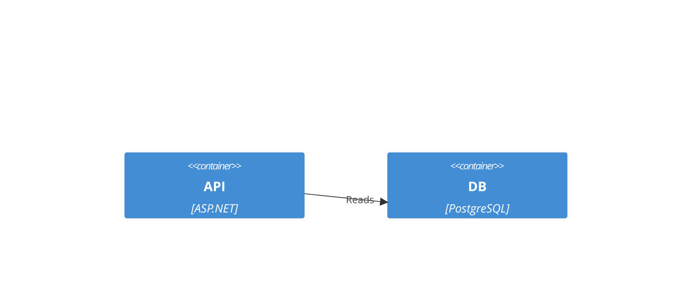
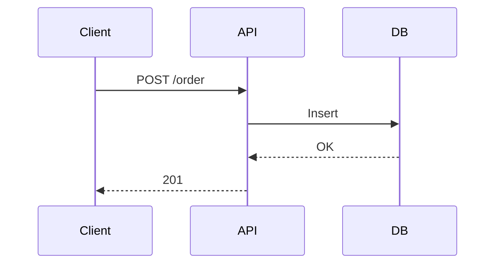

## PURPOSE

Orchestrate full LaTeX PDF generation: load data from JSON, a markdown file, or a collection of markdown files — extract Mermaid/Graphviz diagram blocks, generate PNGs via `capability:diagram:generate`, then compile the PDF via `capability:latex:write`.

## EXECUTION

1. **Resolve Data Source**

   Detect the `--data` input type and load template variables:

   | `--data` value | Type | Action |
   |---|---|---|
   | Starts with `{` | JSON string | Parse directly as template variables |
   | Path to a `.md` file | Markdown file | Read file → extract variables and diagram blocks |
   | Path to a directory | Collection | Read all `.md` files → merge content into template variables |
   | Omitted | None | Use empty data, rely on template defaults |

2. **Extract from Markdown** (when `--data` is a file or directory)

   - **Parse front matter** (YAML between `---` delimiters) as template variables
   - **Extract named diagram blocks** — fenced code blocks tagged with a diagram key (optionally with explicit renderer):
     ````
     ```mermaid diagram_sequence
     sequenceDiagram
       Client->>API: POST /order
     ```

     ```d2 diagram_arch
     direction: down
     wasm -> bff: GraphQL
     ```

     ```python diagram_infra
     from diagrams import Diagram
     from diagrams.azure.compute import AppService
     ...
     ```
     ````
   - **Extract unnamed diagram blocks** — indexed as `diagram_1`, `diagram_2`, etc.; renderer auto-selected per diagram content
   - **Map section headings to template fields** — e.g. `## Overview` → `overview`, `## Core Responsibilities` → `core_responsibilities`
   - **For collections** (directory): merge all files — later files override earlier ones for the same key; diagrams indexed by filename prefix + block index

3. **Generate Diagrams**

   For each `diagram_*` key whose value is diagram source code:

   - **Select the best renderer** using the table below
   - Invoke `capability:diagram:generate` with renderer type in parallel
   - Replace value with generated PNG path
   - Save PNGs to `--diagrams-dir` (default: `<output_dir>/diagrams/`)

   **Renderer selection — apply the first matching rule:**

   | Condition | Renderer | Rationale |
   |---|---|---|
   | Value ends with `.png`, `.svg`, `.pdf` or starts with `/`, `./`, `~/` | _(skip — already a path)_ | Pre-existing image |
   | Starts with `from diagrams import` or `from diagrams.` | `diagrams` | AWS/Azure/GCP/K8s cloud icons |
   | Starts with `@startuml` | `plantuml` | Formal C4 with Person/System/Container icons |
   | Starts with `digraph`, `graph {`, `strict digraph` | `graphviz` | Graph/dependency layout with `splines=ortho` |
   | Starts with `C4Context`, `C4Container`, `C4Component` | `d2` | Architecture diagrams — cleanest layout via ELK |
   | Starts with any other Mermaid keyword (`graph`, `flowchart`, `sequenceDiagram`, `erDiagram`, `mindmap`, `gitgraph`, etc.) | `mermaid` | Sequence flows, flowcharts, inline markdown diagrams |
   | Tagged with explicit renderer hint (e.g. ` ```d2 diagram_arch`) | use tagged renderer | User override takes precedence |

4. **Compile PDF**

   Invoke `capability:latex:write` with resolved data (all `diagram_*` keys now contain PNG paths).

5. **Report**

   Confirm PDF path, list diagrams generated, report any skipped placeholders.

## DELEGATION

- `capability:diagram:generate` — Render diagram code to PNG (parallel for multiple diagrams)
- `capability:latex:write` — Compile LaTeX template to PDF

## WORKFLOW



## EXAMPLES

```
# From JSON data
/behavior:document:latex \
  --template architecture-overview \
  --output ./docs/architecture.pdf \
  --data '{"project_name":"MySystem","diagram_context":"C4Context\n  Person(u,\"User\")\n  System(s,\"System\")\n  Rel(u,s,\"Uses\")"}'

# From a single markdown file (front matter + mermaid blocks extracted)
/behavior:document:latex \
  --template service-architecture \
  --output ./docs/service.pdf \
  --data ./docs/service-architecture.md

# From a collection directory (all .md files merged)
/behavior:document:latex \
  --template architecture-overview \
  --output ./docs/full-architecture.pdf \
  --data ./docs/architecture/

# With pre-existing diagram images
/behavior:document:latex \
  --template service-data-model \
  --output ./docs/model.pdf \
  --data '{"service_name":"Payment","diagram_er":"./diagrams/er.png"}'
```

### Markdown File Format

```markdown
---
service_name: OrderService
author: Team
date: 2026-03-26
---

## Overview
Brief service description here.

## Core Responsibilities
Handles order lifecycle management.




```

## OUTPUT

- PDF file at `--output` path
- List of diagrams generated (name → PNG path)
- Skipped placeholders (diagram_* keys without code or path)
- Compilation status
