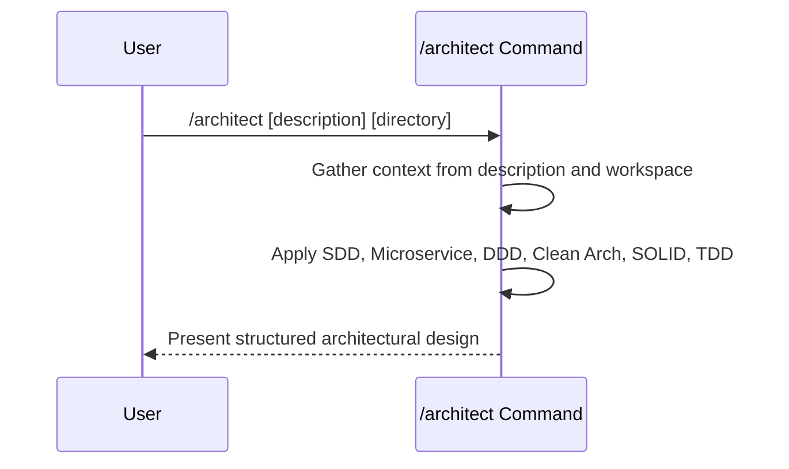

## PURPOSE

Analyze available context and produce a structured architectural design following:

0. **Specification Driven Design** — document behavior before implementation
1. **Microservice Architecture** — autonomous, bounded services with independent deployability
2. **Domain Driven Design** — ubiquitous language, bounded contexts, aggregates, domain events
3. **Clean Architecture** — dependency inversion, layered separation, framework independence
4. **SOLID Principles** — single responsibility, open/closed, Liskov, interface segregation, dependency inversion

## EXECUTION

1. **Context Gathering**: Collect all available input
   - Read provided description or work item context
   - Explore workspace directory for existing implementations, patterns, and domain models
   - Scan available documentation, ADRs, and event catalogs

2. **Architectural Design**: Reason and produce
   - Bounded context map with service boundaries and ownership
   - Domain model: aggregates, entities, value objects, domain events
   - Clean Architecture layer breakdown per service (Domain, Application, Infrastructure, Presentation)
   - Service interaction patterns: sync (REST/gRPC) vs async (events/messages)
   - Data ownership and consistency strategy (eventual vs strong)
   - Test strategy per layer (unit, integration, contract, e2e)
   - SDD specification outline: behavior descriptions per component before implementation

3. **Presentation**: Deliver structured architectural output
   - Organize by domain, then service, then layer
   - Reference specific files or patterns found in workspace when applicable
   - Flag architectural risks, violations, or trade-offs

## WORKFLOW



## ACCEPTANCE CRITERIA

- Produces bounded context map with explicit service boundaries
- Domain model covers aggregates, entities, value objects, and domain events
- Clean Architecture layers defined per service
- Service interactions specify sync vs async patterns
- Test strategy defined per architectural layer
- SDD specification outline provided per component
- Does NOT generate clarifying questions — delegates to `/behavior:management:clarify` for that
- Does NOT generate documentation artifacts — delegates to `/skill:document:write` for that

## EXAMPLES

```
/architect --work-description "Multi-tenant SaaS with microservices"
/architect --work-directory ./workspace/payments.worktrees/master
/architect --work-description "Event-driven order processing" --work-directory ./workspace/orders.worktrees/feature/checkout
```
