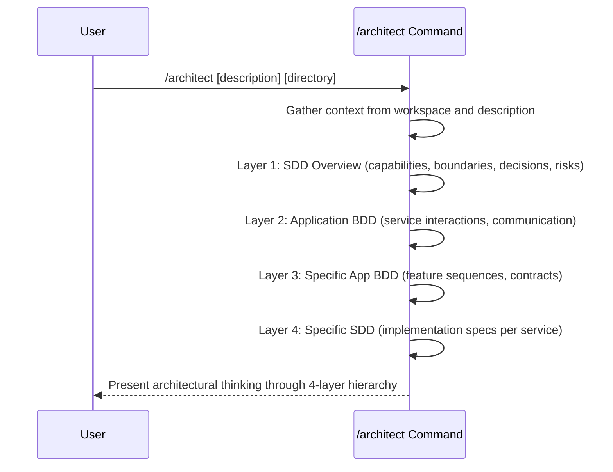

## PURPOSE

Analyze available context through a hierarchical thinking approach to produce architectural insights following industry best practices:

- **Specification Driven Design** — behavior before implementation
- **Domain Driven Design** — bounded contexts, ubiquitous language, aggregates, domain events
- **Clean Architecture** — dependency inversion, layered separation, framework independence
- **SOLID Principles** — SRP, OCP, LSP, ISP, DIP
- **Vertical Slice Architecture** — feature-focused organization
- **Microservice Architecture** — autonomous, bounded services with independent deployability

## EXECUTION

Output thinking through a 4-layer hierarchy (analysis only, no document generation):

### Layer 1: SDD Overview
Analyze the complete architectural design from a Specification Driven Design perspective:
- Core business capabilities and their dependencies
- System boundaries and deployment units
- Cross-cutting concerns (auth, logging, monitoring, error handling)
- Non-functional requirements (scalability, consistency, availability)
- Technology constraints and architectural decisions
- Risk factors and trade-off analysis

### Layer 2: Application BDD
Define how applications/services will interact in the designed architecture:
- System-level interaction patterns and sequences
- Synchronous vs asynchronous communication strategies
- Event-driven patterns and eventual consistency boundaries
- Data flow across service boundaries
- Failure modes and resilience patterns
- System-wide contract definitions (APIs, messages, events)

### Layer 3: Specific Application BDD
Scope BDD to individual services/features/applications:
- Feature-level behavior sequences per vertical slice
- User journeys through the application
- Integration points with other services (contracts)
- Domain event flows within bounded context
- Edge cases and error scenarios per feature
- Acceptance criteria for each feature

### Layer 4: Specific SDD
Define implementation specifications per service/feature:
- Clean Architecture layers: Domain → Application → Infrastructure → Presentation
- Domain model: aggregates, entities, value objects, domain events
- Repository and service boundaries
- Dependency injection and inversion of control patterns
- Data persistence strategy per aggregate
- Test strategy per architectural layer (unit, integration, contract, e2e)

## WORKFLOW



## ACCEPTANCE CRITERIA

Output THINKING only, analyzing:
- **Layer 1**: Core capabilities, deployment units, cross-cutting concerns, decisions, risks
- **Layer 2**: Application interactions, communication patterns, event flows, resilience
- **Layer 3**: Feature-level BDD, vertical slices, edge cases, acceptance criteria
- **Layer 4**: Clean Architecture layers, domain model, repositories, testing strategy

Quality requirements:
- Reasoning grounded in DDD, Clean Architecture, SOLID, vertical slice patterns
- Trade-offs explicitly identified and justified
- Architectural decisions reference constraints and non-functional requirements
- Implementation-agnostic analysis (no code generation, no document creation)
- Each layer builds on previous layer's conclusions
- Does NOT generate clarifying questions — delegates to `/behavior:management:clarify` for that
- Does NOT generate documentation — delegates to `/capability:document:write` for that
- Does NOT generate code — delegates to development workflows

## CONTEXT GATHERING

Before executing the 4-layer thinking:

1. **Workspace Analysis**
   - Scan existing bounded contexts, aggregates, and domain events
   - Identify established service boundaries and dependencies
   - Review architectural decisions and ADRs
   - Understand data ownership patterns

2. **Requirement Analysis**
   - Extract business capabilities and user journeys
   - Identify non-functional requirements (scale, latency, consistency)
   - Recognize constraints (tech stack, deployment model, team structure)
   - Flag assumptions to validate

3. **Cross-Layer Validation**
   - Ensure Layer 1 decisions cascade into Layer 2-4
   - Identify conflicts or inconsistencies between layers
   - Trace trade-offs from business requirements through implementation

## EXAMPLES

```
/architect --work-description "Multi-tenant SaaS with microservices" --focus "service-architecture"
/architect --work-directory ./workspace/payments.worktrees/master --context "PCI-DSS compliance required"
/architect --work-description "Event-driven order processing" --work-directory ./workspace/orders.worktrees/feature/checkout --focus "data-model"
/architect --work-description "Real-time notifications system" --focus "test-plan"
```
