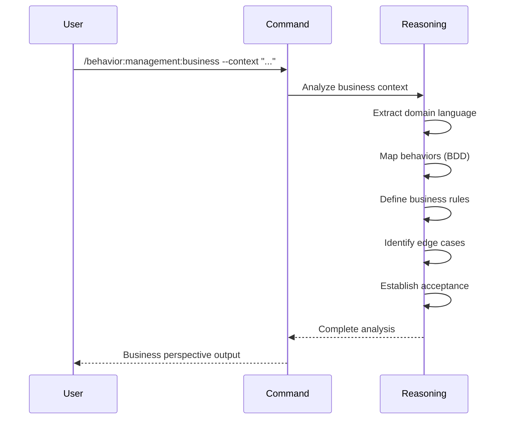

## PURPOSE

Analyze a system, feature, or domain from a pure **business and BDD (Behavior Driven Design)** perspective. This command reasons directly about business intent, user behaviors, and observable outcomes without prescribing technical architecture.

Think of this as the **business analyst layer**. It grounds the system in real business value, domain language, and behavioral expectations.

## EXECUTION

1. **Establish Business Context**
   - Identify primary actors and user personas
   - Define problems being solved and business outcomes expected
   - Map organizational constraints and success metrics
   - Document assumptions about the business environment

2. **Capture Domain Language**
   - Extract ubiquitous language glossary
   - Define business terms, entities, and relationships
   - Clarify how business talks about the problem
   - Establish shared vocabulary across stakeholders

3. **Map Behaviors and Value Streams**
   - Document business-level feature narratives using Given/When/Then structure
   - Trace end-to-end user journeys from trigger to desired outcome
   - Identify decision points and alternative flows
   - Define observable business outcomes per behavior

4. **Define Business Rules and Policies**
   - Extract explicit invariants and constraints
   - Document business policies governing the domain
   - Clarify what must always be true
   - Identify enforcement points and exceptions

5. **Identify Edge Cases and Exceptions**
   - Document business-level edge cases
   - Define alternative flows and error conditions
   - Specify recovery and retry policies
   - Clarify stakeholder expectations for exceptions

6. **Establish Acceptance Criteria**
   - Define measurable, observable business outcomes
   - Document success criteria per behavior
   - Specify acceptance thresholds and metrics
   - Connect behaviors to business value

## DELEGATION

This command reasons directly without agent invocation. No agents defined in frontmatter — all analysis is inline reasoning from business perspective.

## WORKFLOW



## ANALYSIS SECTIONS

The command produces structured business analysis in these sections:

### Business Context
- Problem statement (what business challenge exists)
- Primary actors and personas
- Desired outcomes and success metrics
- Organizational constraints
- Assumptions and dependencies

### Ubiquitous Language
- Key business terms (entity, aggregate, value object, service names in business domain)
- Relationships between concepts
- Alternative names or synonyms to avoid
- Terms that mean different things in different contexts

### Value Streams and Journeys
- End-to-end user flows with business outcomes
- Trigger events and terminal states
- Decision branches with business rationale
- Metrics that indicate successful completion

### Behavior Narratives (BDD-style)
Feature narratives at business level (not test code):
```
Given [business context]
When [user action or event]
Then [observable business outcome]
```

Examples of behaviors, not exhaustive test cases.

### Business Rules and Policies
- Invariants (must always be true)
- Constraints (limits or thresholds)
- Policies (how decisions are made)
- Enforcement responsibilities (who validates)

### Edge Cases and Alternatives
- Boundary conditions (limits, thresholds)
- Exception scenarios (error states, failures)
- Alternative flows (variations in behavior)
- Recovery and compensation policies

### Acceptance Criteria
- Observable, measurable business outcomes
- Success criteria per behavior
- Acceptance thresholds (quantified where possible)
- Connected to business value

## EXAMPLES

```
/behavior:management:business --context "Multi-tenant notification service with email, SMS, and push channels"

/behavior:management:business --work-directory ./workspace/payments.worktrees/master

/behavior:management:business --context "Refactor payment gateway integration to support new providers"

/behavior:management:business --context "SaaS subscription management with tiering, upgrades, downgrades, and cancellation"
```

## OUTPUT

- Structured business analysis document
- Ubiquitous language glossary
- BDD-style behavior narratives
- Business rules and policies
- Acceptance criteria mapped to behaviors
- Edge cases and exception handling policies
