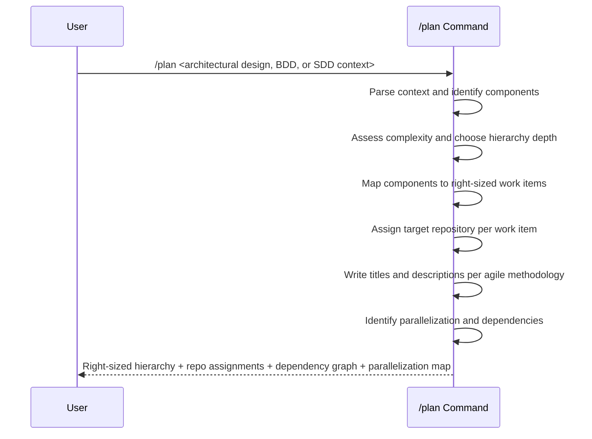

## PURPOSE

Decompose an architectural design or SDD context into a right-sized agile work-item hierarchy for human or agent team execution. Produces a structured plan with dependency graph, repository assignments, and parallelization map. Favors meaningful pull requests over granular tasks.

## EXECUTION

1. **Context Analysis**: Understand the input
   - Parse the provided architectural design, BDD, SDD, or description
   - Identify system components, bounded contexts, and service boundaries
   - Assess complexity to determine the appropriate number of hierarchy layers

2. **Right-Size the Hierarchy**: Choose the minimal layers needed
   - **PRINCIPLE**: Maximize meaningful development changes per work item — avoid splitting into trivially small tasks
   - Use only the hierarchy layers that add value for the scope:
     - Simple epics: Epic → User Story (skip Features and Tasks)
     - Medium epics: Epic → Feature → User Story
     - Complex epics: Epic → Feature → User Story → Task
   - **Each leaf work item must represent a meaningful pull request** with substantial, reviewable changes — not a single-file edit or config tweak
   - Merge related small changes into a single work item rather than creating many trivial ones
   - When in doubt, use fewer layers with larger scope per work item

3. **Agile Methodology Compliance**: Titles and descriptions
   - **Epics**: Business capability or initiative (e.g., "Enable multi-tenant notification delivery")
   - **Features**: Component-level deliverable (e.g., "Email channel integration with template engine")
   - **User Stories**: Written from user/actor perspective using "As a [role], I want [goal], so that [benefit]" format (e.g., "As a tenant admin, I want to configure SMS providers, so that tenants can send notifications via their preferred carrier")
   - **Tasks**: Implementation action scoped to a single pull request (e.g., "Implement RabbitMQ consumer for notification dispatch")
   - Descriptions must include acceptance criteria, scope boundaries, and expected outcomes

4. **Repository Assignment**: Explicit repository per work item
   - **MANDATORY**: Every work item must specify which repository it targets in its description
   - Format: `Repository: <repo-name>` as the first line of the description
   - Cross-repository work items must list all affected repositories
   - This prevents implementations landing in wrong repositories

5. **Parallelization and Dependency Mapping**
   - Identify parallelization opportunities: independent work items that can be developed concurrently
   - Map sequential dependencies: items that must complete before others can start (`consumes-from`)
   - Define collaboration boundaries: related items that share context or interfaces (`related`)
   - Balance parallelization vs. collaboration: maximize concurrency while preserving team coordination points

6. **Plan Output**
   - Right-sized work-item hierarchy with only the necessary layers
   - Repository assignment per work item
   - Dependency graph showing `consumes-from` and `related` relationships
   - Parallelization map indicating which items can run concurrently
   - Sequence groups: waves of work that can be executed in parallel within each wave

## WORKFLOW



## ACCEPTANCE CRITERIA

- Hierarchy uses only the layers needed — no unnecessary depth
- Each leaf work item scoped as a meaningful pull request with substantial changes
- Every work item specifies its target repository in the description
- User Story titles follow "As a [role], I want [goal], so that [benefit]" format
- Epic and Feature titles describe business capabilities or deliverables
- Descriptions include acceptance criteria and scope boundaries
- All `consumes-from` dependencies explicitly identified
- All `related` collaboration boundaries explicitly identified
- Parallelization map groups work items into concurrent execution waves
- No clarifying questions — delegates to `/behavior:management:clarify` for that
- No architectural decisions — delegates to `/behavior:management:architect` for that

## EXAMPLES

```
/plan "Payment service with checkout, refund, and webhook handling aligned to DDD bounded contexts"
/plan "Notification microservice: email, SMS, push — event-driven, multi-tenant"
```

## OUTPUT

- Right-sized work-item hierarchy (minimal layers needed)
- Repository assignment per work item
- Dependency graph (`consumes-from`, `related`)
- Parallelization map with concurrent execution waves
- Estimated team/agent parallelism capacity per wave
