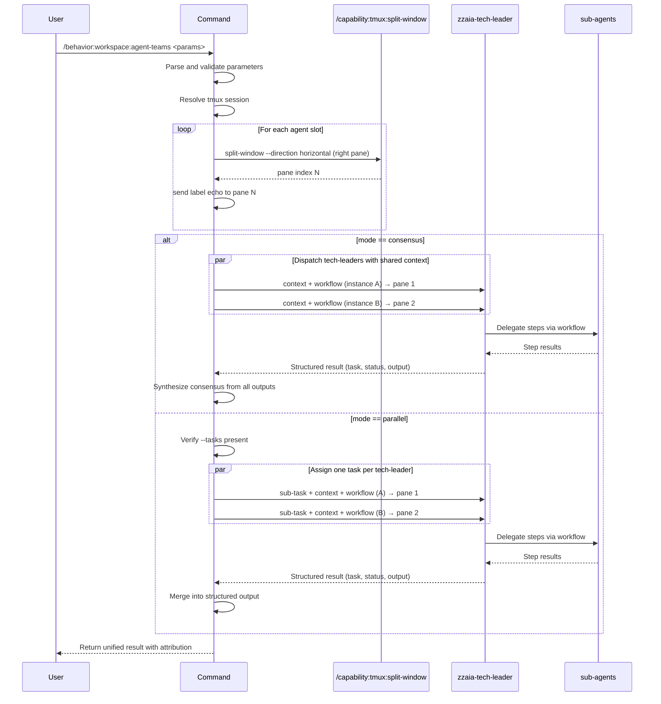

## PURPOSE

Orchestrate teams of specialized agents to execute tasks collaboratively. Each agent teammate runs in a dedicated tmux pane (horizontal split on the right side of the current window), allowing the user to observe all agent conversations simultaneously. Choose between consensus mode (multiple agents analyze a single problem independently, then synthesize results) or parallel mode (distribute decomposed sub-tasks across agents with shared context).

## EXECUTION

### Setup Tmux Panes (both modes)

Before dispatching any agents, set up one tmux pane per agent teammate:

1. **Resolve Session**: Use `--session` if provided; otherwise detect the current tmux session via `$TMUX` or `tmux display-message -p '#S'`
2. **Count Agents**: Determine the number of agents to dispatch (from `--agents`, auto-selection, or task count)
3. **Create Panes**: For each agent, call `/capability:tmux:split-window --name <session> --direction horizontal` to create a right-side horizontal split
4. **Label Panes**: Send a visible label to each pane using `/capability:tmux:send-keys` — e.g. `echo "=== Agent: <name> | Task: <task> ==="` — so the user can identify each pane
5. **Record Pane Indexes**: Track the pane index assigned to each agent for later monitoring

### consensus mode

1. **Parse Input**: Extract `--context` and `--agents` (or auto-select 2-3 agents suited to task)
2. **Setup Panes**: Create one labeled tmux pane per agent (see above)
3. **Dispatch**: Send all selected agents the same context simultaneously, each running in its assigned pane
4. **Collect**: Gather independent outputs from all agents
5. **Synthesize**: Identify agreements, resolve conflicts, merge complementary insights
6. **Return**: Unified consensus response with clear attribution

### parallel mode

1. **Validate**: Ensure `--tasks` is provided; fail gracefully if absent
2. **Parse Input**: Extract `--context`, `--tasks`, and `--max-agents` (default: unlimited)
3. **Assign**: Map agents to individual tasks (auto-select or use `--agents`)
4. **Setup Panes**: Create one labeled tmux pane per active agent slot (up to `--max-agents`)
5. **Dispatch**: Send up to `--max-agents` agents simultaneously, each in its assigned pane; queue remaining tasks and dispatch each as a slot frees up, reusing freed panes
6. **Collect**: Gather all task outputs with agent attribution
7. **Combine**: Merge into structured result with per-task grouping
8. **Return**: Combined output with clear task-to-agent mapping

## DELEGATION

**MANDATORY**: Always invoke the agents defined in this command's frontmatter for their designated responsibilities. Never skip, replace, or simulate their behavior directly.

- `zzaia-tech-leader` — Lead task execution through a given workflow using sub-agents; coordinates and reports results back to the team session

## WORKFLOW



## ACCEPTANCE CRITERIA

- One tmux horizontal pane is created per agent before dispatch; panes are labeled with agent name and task
- Session is resolved from `--session` or auto-detected from the current tmux context
- Consensus mode produces synthesized output reflecting all agent perspectives
- Parallel mode correctly maps sub-tasks to agents with shared context; panes are reused as slots free up
- Missing `--tasks` in parallel mode fails with clear error message
- Results include clear agent attribution for traceability
- `zzaia-tech-leader` is always the dispatched agent; `--agents` overrides for advanced use only

## EXAMPLES

```
/behavior:workspace:agent-teams --mode consensus --context "Design a REST API for managing user accounts" --description "Get architectural perspectives on API design"

/behavior:workspace:agent-teams --mode parallel --context "Refactor legacy authentication module" --tasks "Update login handler, Migrate session storage, Add MFA support" --max-agents 3

/behavior:workspace:agent-teams --mode consensus --context "Evaluate framework choice for real-time messaging"
```

## OUTPUT

- **Tmux layout**: One labeled right-side horizontal pane per active agent, visible before dispatch begins
- **Consensus mode**: Unified synthesis document with merged insights and clear distinction of perspectives
- **Parallel mode**: Structured output organized by task with individual agent results and combined summary
- **Agent attribution**: Each result includes clear identification of responsible agent and pane index
- **Error handling**: Explicit failure message if required parameters are missing or tmux session cannot be resolved
