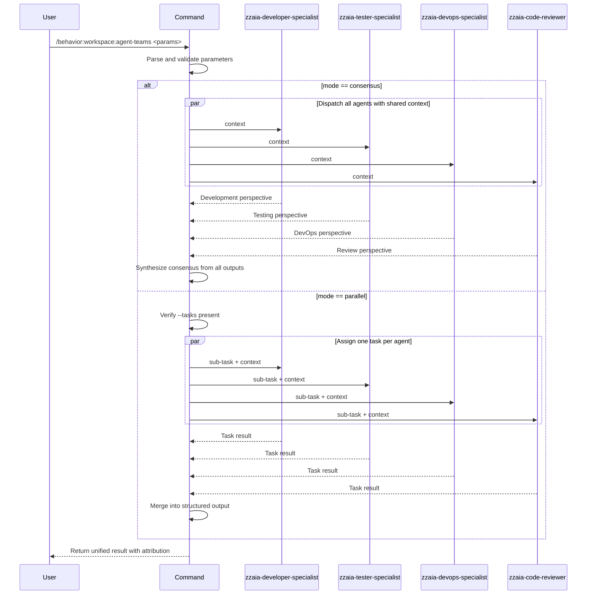

## PURPOSE

Orchestrate teams of specialized agents to execute tasks collaboratively. Choose between consensus mode (multiple agents analyze a single problem independently, then synthesize results) or parallel mode (distribute decomposed sub-tasks across agents with shared context).

## EXECUTION

### consensus mode

1. **Parse Input**: Extract `--context` and `--agents` (or auto-select 2-3 agents suited to task)
2. **Dispatch**: Send all selected agents the same context simultaneously
3. **Collect**: Gather independent outputs from all agents
4. **Synthesize**: Identify agreements, resolve conflicts, merge complementary insights
5. **Return**: Unified consensus response with clear attribution

### parallel mode

1. **Validate**: Ensure `--tasks` is provided; fail gracefully if absent
2. **Parse Input**: Extract `--context` and `--tasks` list
3. **Assign**: Map agents to individual tasks (auto-select or use `--agents`)
4. **Dispatch**: Send all agents simultaneously, each with sub-task plus shared `--context`
5. **Collect**: Gather all task outputs with agent attribution
6. **Combine**: Merge into structured result with per-task grouping
7. **Return**: Combined output with clear task-to-agent mapping

## WORKFLOW



## ACCEPTANCE CRITERIA

- Consensus mode produces synthesized output reflecting all agent perspectives
- Parallel mode correctly maps sub-tasks to agents with shared context
- Missing `--tasks` in parallel mode fails with clear error message
- Results include clear agent attribution for traceability
- Auto-selection of agents occurs when `--agents` is omitted

## EXAMPLES

```
/behavior:workspace:agent-teams --mode consensus --context "Design a REST API for managing user accounts" --description "Get architectural perspectives on API design"

/behavior:workspace:agent-teams --mode parallel --context "Refactor legacy authentication module" --tasks "Update login handler, Migrate session storage, Add MFA support" --agents "zzaia-developer-specialist,zzaia-code-reviewer"

/behavior:workspace:agent-teams --mode consensus --context "Evaluate framework choice for real-time messaging"
```

## OUTPUT

- **Consensus mode**: Unified synthesis document with merged insights and clear distinction of perspectives
- **Parallel mode**: Structured output organized by task with individual agent results and combined summary
- **Agent attribution**: Each result includes clear identification of responsible agent
- **Error handling**: Explicit failure message if required parameters are missing
