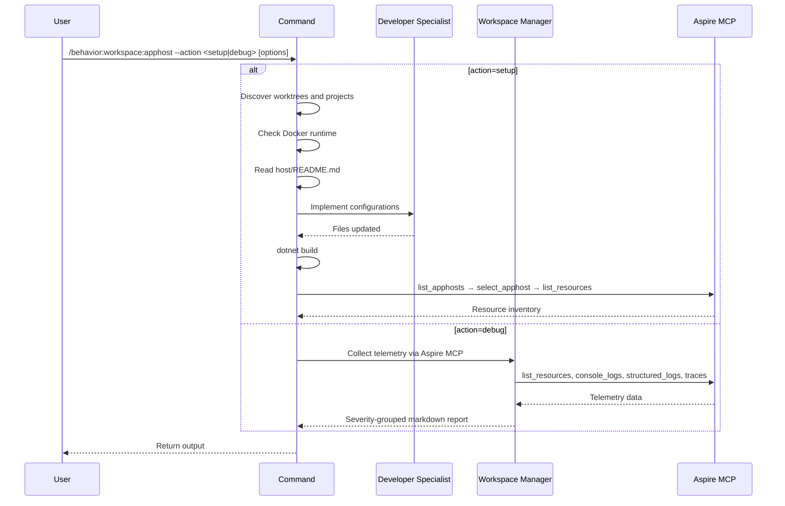

## PURPOSE

Single interface for Aspire AppHost management. Routes to setup or diagnostics based on `--action`.

## ACTIONS

| Action  | Description                                                  |
|---------|--------------------------------------------------------------|
| `setup` | Register workspace applications into AppHost and validate    |
| `debug` | Collect telemetry via MCP and generate structured issue report |

## EXECUTION

### action=setup

1. **Discover Projects** — Parse `--applications` as `name` or `name:branch` (defaults to `master`); glob `workspace/{name}.worktrees/{branch}/src/**/*.csproj`
2. **Ensure Docker** — Check `docker info`; start Docker if not running
3. **Read Documentation** — Read `host/README.md` for configuration patterns
4. **Generate Configurations** — Delegate to `zzaia-developer-specialist` to implement settings, registrations, project references, and appsettings
5. **Validate Build** — Run `dotnet build`; fix compilation errors
6. **Verify with Aspire MCP** — Discover AppHost, select it, and list resources to confirm all services appear

### action=debug

1. **Discover Resources** — List all running resources; filter by `--application` if set
2. **Collect Telemetry** — For each resource: console logs, structured logs, traces, trace logs
3. **Report** — Categorize by severity ❌ ⚠️; group by application; output markdown report

## DELEGATION

**MANDATORY**: Always invoke the agents defined in this command's frontmatter for their designated responsibilities. Never skip, replace, or simulate their behavior directly.

- `zzaia-developer-specialist` — Implements all `setup` configuration changes
- `zzaia-workspace-manager` — Executes all `debug` MCP telemetry collection

## WORKFLOW



## ACCEPTANCE CRITERIA

- `setup`: all worktrees valid, build passes, all services appear in Aspire resource list
- `debug`: read-only, report includes summary table per application

## EXAMPLES

```
/behavior:workspace:apphost --action setup --applications "order-service payment-service:feature/checkout"
/behavior:workspace:apphost --action debug
/behavior:workspace:apphost --action debug --application api-service
```

## OUTPUT

- `setup`: build result + Aspire resource inventory
- `debug`: markdown report — Application | Errors | Warnings | Failed Traces | Status
