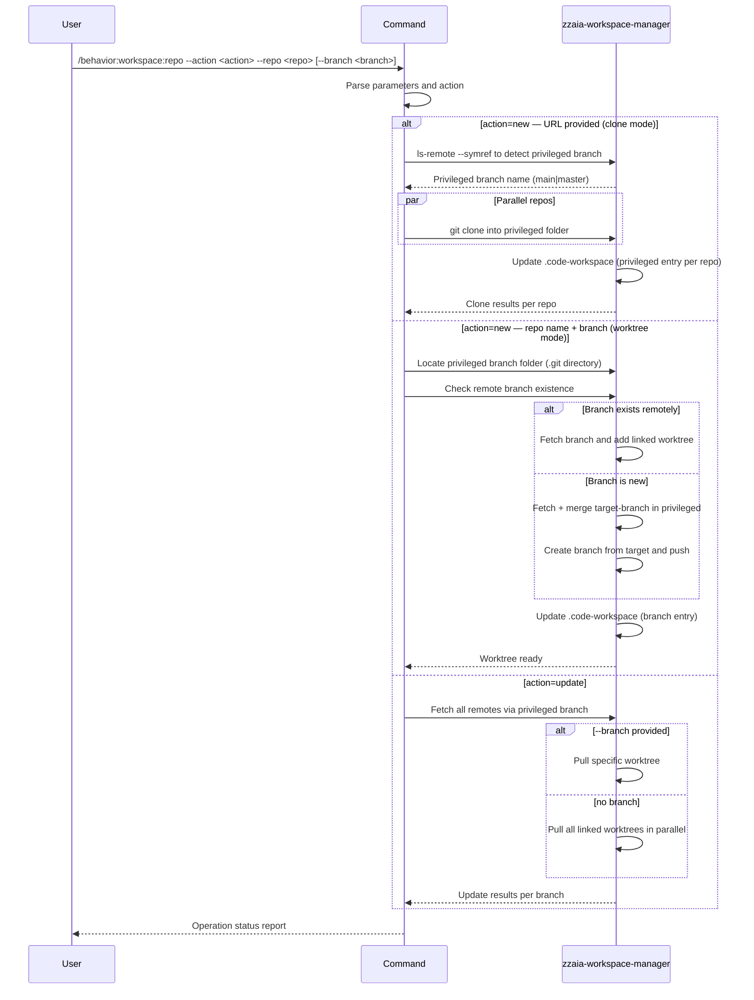

## PURPOSE

Single interface for workspace repository management. Routes to clone, branch creation, or update based on `--action` and provided parameters.

## ACTIONS

| Action   | Description                                                                |
|----------|----------------------------------------------------------------------------|
| `new`    | Set up a new repo with a privileged clone, or add a linked worktree branch |
| `update` | Pull latest remote changes for one branch or all branches in a repo        |

## MANDATORY RULES

- **ALWAYS use the privileged-branch worktree structure.** One branch is cloned normally and acts as the git anchor; all other branches are linked worktrees from it.
- **Detect the privileged branch from remote** — query `HEAD` via `git ls-remote --symref` to resolve `main` or `master` before cloning.
- **ALWAYS update `.code-workspace`** — every new worktree branch must be registered as a folder entry.
- **NEVER create a new local branch before fetching the target-branch from remote.**
- No destructive operations on existing worktrees.

## EXECUTION

### action=new — Initial Repository Setup (URL provided)

1. **Validate** — Confirm HTTPS or SSH git URL format; derive `repoName` from URL
2. **Reject duplicates** — If `./workspace/repoName.worktrees/` already exists, stop and report
3. **Detect privileged branch** — Query remote HEAD to resolve the default branch name:
   - `git ls-remote --symref <url> HEAD` → parse `ref: refs/heads/<name>` → use `<name>` as `<privileged>`
   - Fallback order if unresolvable: `main` → `master`
4. **Clone privileged branch** — Full clone into the privileged folder:
   - `git clone <url> ./workspace/repoName.worktrees/<privileged>/`
5. **Update `.code-workspace`** — Append a new folder entry for the privileged worktree:
   - `{ "path": "workspace/repoName.worktrees/<privileged>", "name": "repoName/<privileged>" }`
   - Find the `.code-workspace` file at the workspace root and insert into the `folders` array
6. **Parallel** — Dispatch multiple distinct repos in parallel when multiple URLs provided

### action=new — Branch Worktree (repo name + branch provided)

1. **Validate** — Identify the privileged branch folder: find the directory inside `./workspace/repoName.worktrees/` that contains a `.git` directory (not a `.git` file); fail if not found — run initial setup first
2. **Derive path** — Split branch name on `/` to build the worktree path:
   - `feature/implement-something` → `./workspace/repoName.worktrees/feature/implement-something/`
   - `fix/issue-9` → `./workspace/repoName.worktrees/fix/issue-9/`
   - `main` (no slash) → `./workspace/repoName.worktrees/main/`
   - Create intermediate directories as needed (`mkdir -p`)
3. **Remote check** — From the privileged branch folder run `git ls-remote --heads origin <branchName>`
   - **Branch exists remotely:**
     - `git -C ./workspace/repoName.worktrees/<privileged>/ fetch origin <branchName>`
     - `git -C ./workspace/repoName.worktrees/<privileged>/ worktree add ../<derived-path> <branchName>`
     - Configure tracking: `git -C ./workspace/repoName.worktrees/<derived-path>/ branch --set-upstream-to=origin/<branchName>`
   - **Branch does not exist remotely:**
     - Fetch and update target-branch first: `git -C ./workspace/repoName.worktrees/<privileged>/ fetch origin <target-branch> && git -C ./workspace/repoName.worktrees/<privileged>/ merge origin/<target-branch>`
     - Create branch from updated target: `git -C ./workspace/repoName.worktrees/<privileged>/ worktree add -b <branchName> ../<derived-path> <target-branch>`
     - Push and set upstream: `git -C ./workspace/repoName.worktrees/<derived-path>/ push -u origin <branchName>`
4. **Update `.code-workspace`** — Append a new folder entry for the created worktree:
   - `{ "path": "workspace/repoName.worktrees/<derived-path>", "name": "repoName/<branchName>" }`

### action=update — Update Branch(es)

1. **Validate** — Identify the privileged branch folder (directory with `.git` directory)
2. **Fetch remotes** — `git -C ./workspace/repoName.worktrees/<privileged>/ fetch --all --prune`
3. **Resolve scope**:
   - `--branch` provided → update only that worktree: `git -C ./workspace/repoName.worktrees/<derived-path>/ pull`
   - No `--branch` → list all worktrees via `git -C ./workspace/repoName.worktrees/<privileged>/ worktree list` and pull each in parallel

## WORKSPACE STRUCTURE

```
./workspace/
├── repoName.worktrees/
│   ├── main/                           # Full clone — privileged branch (detected: main|master)
│   ├── feature/
│   │   └── implement-something/        # Linked worktree — feature/implement-something
│   ├── fix/
│   │   └── issue-9/                    # Linked worktree — fix/issue-9
│   └── plan/
│       └── new-job/                    # Linked worktree — plan/new-job
```

The privileged branch is identified at runtime by presence of a `.git` **directory** (not file) inside the worktree folder. Linked worktrees have `.git` as a file pointing back to the privileged branch's git data.

## CODE-WORKSPACE FORMAT

Each new worktree branch produces one entry in the `.code-workspace` `folders` array:

```json
{ "path": "workspace/repoName.worktrees/feature/implement-something", "name": "repoName/feature/implement-something" }
```

## CONSTRAINTS

- Use RELATIVE paths only — always relative to current working directory
- NEVER use absolute paths like `/home/user/workspace/`
- Always detect and create the privileged branch (main|master) first inside the worktrees folder
- No destructive operations on existing worktrees
- All branch worktrees must be inside the `repoName.worktrees/` folder
- Never create a new local branch before the target-branch is fetched/updated from remote

## DELEGATION

**MANDATORY**: Always invoke the agents defined in this command's frontmatter for their designated responsibilities. Never skip, replace, or simulate their behavior directly.

- `zzaia-workspace-manager` — Executes git operations and `.code-workspace` updates following the procedures above

## WORKFLOW



## ACCEPTANCE CRITERIA

- Clone mode: privileged branch detected from remote HEAD; repo cloned into privileged folder; `.code-workspace` updated
- Branch mode: remote checked; target-branch fetched before new branch creation; linked worktree added; `.code-workspace` updated
- Update mode: fetch run via privileged branch; scope matches `--branch` or all worktrees
- All modes report per-operation status

## EXAMPLES

```
/behavior:workspace:repo --action new --repo https://github.com/username/repository.git
/behavior:workspace:repo --action new --repo https://github.com/username/repo1.git https://github.com/username/repo2.git
/behavior:workspace:repo --action new --repo my-api --branch feature/user-authentication
/behavior:workspace:repo --action new --repo frontend --branch bugfix/header-styling --target-branch develop
/behavior:workspace:repo --action update --repo my-api --branch feature/user-authentication
/behavior:workspace:repo --action update --repo my-api
```

## OUTPUT

- Clone: privileged branch cloned, `.code-workspace` updated, aggregated status
- Branch: linked worktree created, branch pushed if new, `.code-workspace` updated, status confirmation
- Update: branches pulled, skipped (detached/dirty), per-branch status
