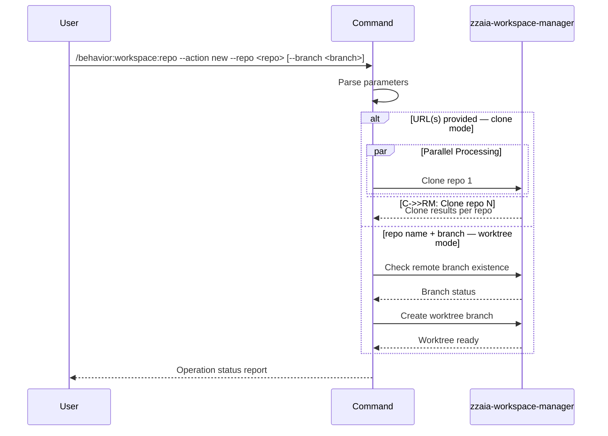

## PURPOSE

Single interface for workspace repository management. Routes to clone or branch creation based on `--action` and provided parameters.

## EXAMPLES

```
/behavior:workspace:repo --action new --repo https://github.com/username/repository.git
/behavior:workspace:repo --action new --repo https://github.com/username/repo1.git https://github.com/username/repo2.git
/behavior:workspace:repo --action new --repo my-api --branch feature/user-authentication
/behavior:workspace:repo --action new --repo frontend --branch bugfix/header-styling --target-branch develop
```

## ACTIONS

| Action | Description                                                              |
|--------|--------------------------------------------------------------------------|
| `new`  | Set up a new repo in worktree structure, or add a worktree branch        |

## MANDATORY RULE

**ALWAYS use the worktree structure.** Never perform a bare `git clone` into a plain directory. Never clone the same repository more than once under different names. Every repository must live at `./workspace/repoName.worktrees/master/` with all branches as worktrees branching from it.

## EXECUTION

### action=new — Initial Repository Setup (URL provided)

1. **Validate** — Confirm HTTPS or SSH git URL format; derive `repoName` from URL
2. **Reject duplicates** — If `./workspace/repoName.worktrees/` already exists, stop and report — do not clone again
3. **Clone into worktree root** — `git clone <url> ./workspace/repoName.worktrees/master/`
4. **Metadata** — Generate `./workspace/repoName.worktrees/repository-metadata.json`
5. **Parallel** — Dispatch multiple distinct repos in parallel when multiple URLs provided

### action=new — Branch Worktree (repo name + branch provided)

1. **Validate** — Confirm `./workspace/repoName.worktrees/master/` exists; fail if not — run initial setup first
2. **Derive path** — Split branch name on `/` to build the worktree path:
   - `feature/implement-something` → `./workspace/repoName.worktrees/feature/implement-something/`
   - `fix/issue-9` → `./workspace/repoName.worktrees/fix/issue-9/`
   - `plan/new-job` → `./workspace/repoName.worktrees/plan/new-job/`
   - `main` (no slash) → `./workspace/repoName.worktrees/main/`
   - Create intermediate directories as needed (`mkdir -p`)
3. **Remote Check** — From `./workspace/repoName.worktrees/master/` run `git ls-remote --heads origin <branchName>`
   - Output exists → branch exists remotely:
     - `git fetch origin branchName:refs/remotes/origin/branchName`
     - `git worktree add -b branchName <derived-path> origin/branchName`
     - `git config branch.branchName.remote origin`
     - `git config branch.branchName.merge refs/heads/branchName`
   - No output → branch is new:
     - `git worktree add -b branchName <derived-path>`
4. **Metadata** — Update `./workspace/repoName.worktrees/repository-metadata.json`

## WORKSPACE STRUCTURE

```
./workspace/
├── repoName.worktrees/
│   ├── repository-metadata.json
│   ├── master/                         # Reference branch
│   ├── feature/
│   │   └── implement-something/        # feature/implement-something
│   ├── fix/
│   │   └── issue-9/                    # fix/issue-9
│   └── plan/
│       └── new-job/                    # plan/new-job
```

## METADATA FORMAT

```json
{
  "repository": "repoName",
  "worktrees": ["master", "branchName"],
  "active_branch": "branchName"
}
```

## CONSTRAINTS

- Use RELATIVE paths only — always relative to current working directory
- NEVER use absolute paths like `/home/user/workspace/`
- Always create master/main reference branch inside worktrees folder
- No destructive operations on existing worktrees
- All branch worktrees must be inside the `repoName.worktrees/` folder

## DELEGATION

**MANDATORY**: Always invoke the agents defined in this command's frontmatter for their designated responsibilities. Never skip, replace, or simulate their behavior directly.

- `zzaia-workspace-manager` — Executes git operations and generates metadata following the procedures above

## WORKFLOW



## ACCEPTANCE CRITERIA

- Clone mode: repos cloned in parallel; `repository-metadata.json` generated per repo
- Branch mode: remote checked before local creation; worktree metadata updated
- Both modes report per-operation status

## OUTPUT

- Clone: repos cloned to workspace, worktrees created, metadata generated, aggregated status
- Branch: worktree created, branch checked out, metadata updated, status confirmation
