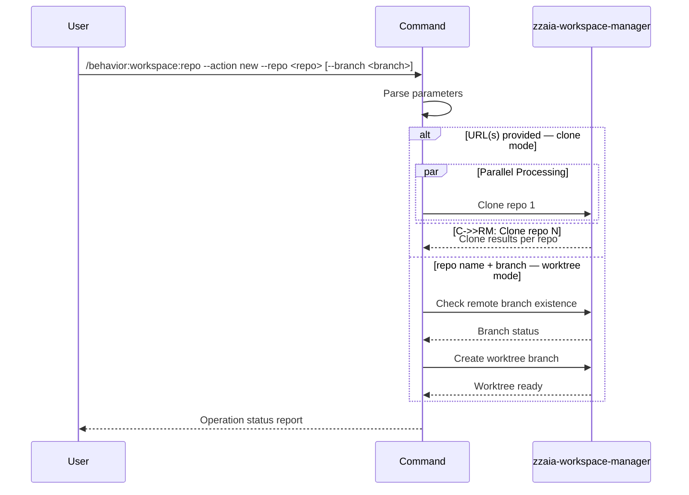

## PURPOSE

Single interface for workspace repository management. Routes to clone or branch creation based on `--action` and provided parameters.

## ACTIONS

| Action | Description                                                    |
|--------|----------------------------------------------------------------|
| `new`  | Clone a new repository or create a worktree branch in existing |

## EXECUTION

### action=new — Repository Cloning (URL provided)

1. **Parse URLs** — Validate HTTPS or SSH git repository URLs
2. **Parallel Dispatch** — Call `zzaia-workspace-manager` for each repository in parallel
3. **Aggregate Results** — Report success/failure per repository

### action=new — Branch Creation (repo name + branch provided)

1. **Parse Input** — Extract repository name and branch name; validate existing worktree structure
2. **Remote Check** — Check remote for branch existence before creating new local one; default base to master/main
3. **Create Worktree** — Call `zzaia-workspace-manager` to create branch worktree and update metadata

## DELEGATION

**MANDATORY**: Always invoke the agents defined in this command's frontmatter for their designated responsibilities. Never skip, replace, or simulate their behavior directly.

- `zzaia-workspace-manager` — Handles repository cloning, worktree management, and workspace integration

## WORKFLOW



## ACCEPTANCE CRITERIA

- Clone mode: repos cloned in parallel; `repository-metadata.json` generated per repo
- Branch mode: remote checked before local creation; worktree metadata updated
- Both modes report per-operation status

## EXAMPLES

```
/behavior:workspace:repo --action new --repo https://github.com/username/repository.git
/behavior:workspace:repo --action new --repo https://github.com/username/repo1.git https://github.com/username/repo2.git
/behavior:workspace:repo --action new --repo my-api --branch feature/user-authentication
/behavior:workspace:repo --action new --repo frontend --branch bugfix/header-styling --target-branch develop
```

## OUTPUT

- Clone: repos cloned to workspace, worktrees created, metadata generated, aggregated status
- Branch: worktree created, branch checked out, metadata updated, status confirmation
