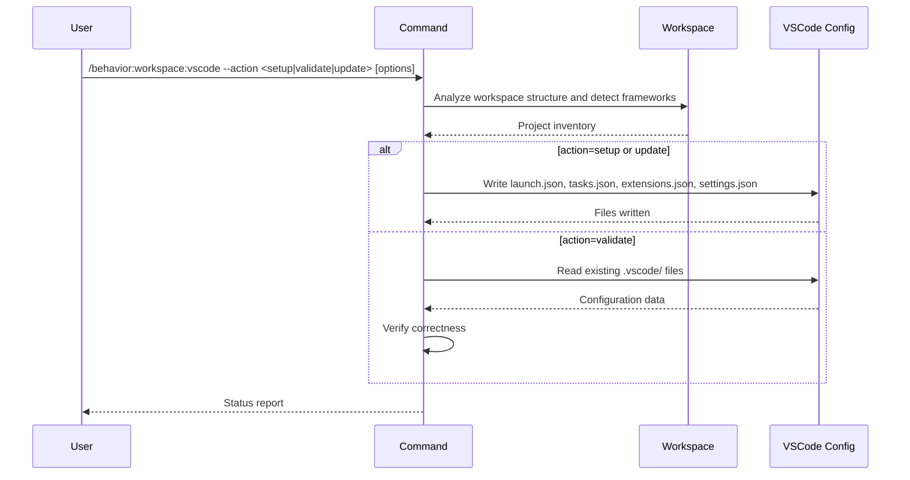

## PURPOSE

Single interface for VSCode configuration management. Routes to generation, validation, or update based on `--action`.

## ACTIONS

| Action     | Description                                              |
|------------|----------------------------------------------------------|
| `setup`    | Generate launch, task, extension, and settings configs   |
| `validate` | Validate existing VSCode configurations for correctness  |
| `update`   | Update existing configurations with detected changes     |

## EXECUTION

### action=setup / update

1. **Workspace Analysis** — Scan workspace for projects; detect frameworks; identify existing configurations
2. **Generate / Update Configurations**
   - `launch.json` — debug launch configurations per framework
   - `tasks.json` — build and run task definitions
   - `extensions.json` — extension recommendations
   - `settings.json` — workspace settings
3. **Apply** — Write `.vscode/` files; report generation status

> For Ubuntu + .NET, always include these environment variables in launch configurations:
> `ASPNETCORE_ENVIRONMENT`, `DOTNET_ENVIRONMENT`, `DOTNET_ROOT`, `DOTNET_HOST_PATH`, `DOTNET_ROLL_FORWARD`, `PATH`

### action=validate

1. **Read** existing `.vscode/` files
2. **Verify** correctness of launch targets, task commands, and settings
3. **Report** — list valid entries, warnings, and missing configurations

## WORKFLOW



## ACCEPTANCE CRITERIA

- `setup`: all .vscode/ files generated per detected frameworks
- `validate`: report lists valid, warning, and missing entries
- `update`: only modifies entries affected by detected changes
- Ubuntu/.NET launch configs always include required environment variables

## EXAMPLES

```
/behavior:workspace:vscode --action setup
/behavior:workspace:vscode --action setup --mode project --repo order-service
/behavior:workspace:vscode --action validate
/behavior:workspace:vscode --action update --repo order-service --branch feature/checkout
```

## OUTPUT

- `.vscode/launch.json`, `.vscode/tasks.json`, `.vscode/extensions.json`, `.vscode/settings.json`
- Configuration status report with framework-specific notes
