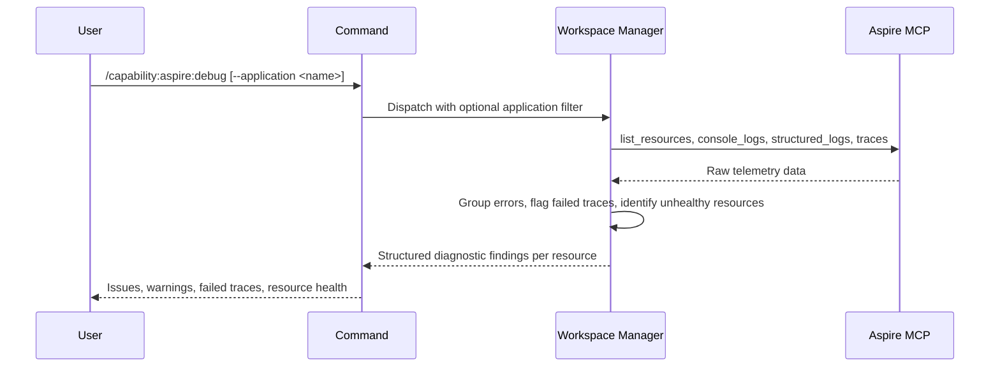

## PURPOSE

Retrieve and analyze Aspire AppHost telemetry. Surfaces errors, failed traces, unhealthy resources, warning patterns, and quality violations across running services. Returns structured diagnostic findings — not raw data.

## EXECUTION

1. **Retrieve Telemetry** — Call `/capability:aspire:query [--application <application>]`
   - Resource list with status
   - Console logs, structured logs, traces per resource

2. **Analyze — Runtime Issues**
   - Identify failed or degraded resources
   - Group errors by severity and resource
   - Flag failed traces and their root service
   - Identify warning patterns and recurrence

3. **Analyze — Quality Issues**
   - Detect resources failing health probes or startup checks
   - Flag configuration mismatches (missing env vars, invalid connection strings, misconfigured dependencies)
   - Identify resources with high restart counts or crash loops
   - Surface dependency availability issues (downstream services unreachable)
   - Detect missing or incomplete distributed traces indicating instrumentation gaps

4. **Return Findings** — Structured diagnostic output per resource with severity tags and quality violations

## DELEGATION

**MANDATORY**: Always invoke the agents defined in this command's frontmatter for their designated responsibilities. Never skip, replace, or simulate their behavior directly.

- `zzaia-workspace-manager` — Query Aspire MCP and analyze telemetry data

## WORKFLOW



## ACCEPTANCE CRITERIA

- All resources discovered (or filtered to specified application)
- Errors grouped by resource and severity
- Failed traces identified with originating service
- Unhealthy or degraded resources flagged
- Quality violations identified: health probe failures, config mismatches, crash loops, dependency issues, instrumentation gaps
- Timestamps included for all events

## EXAMPLES

```
/capability:aspire:debug
```

```
/capability:aspire:debug --application order-service
```

## OUTPUT

- **Resource Health**: Status per resource (healthy/degraded/failed)
- **Errors**: Error logs grouped by resource and type
- **Failed Traces**: Trace failures with originating service and context
- **Warnings**: Warning patterns with recurrence
- **Quality Violations**: Health probe failures, config mismatches, crash loops, dependency unavailability, instrumentation gaps
- **Timeline**: Chronological event summary per resource
