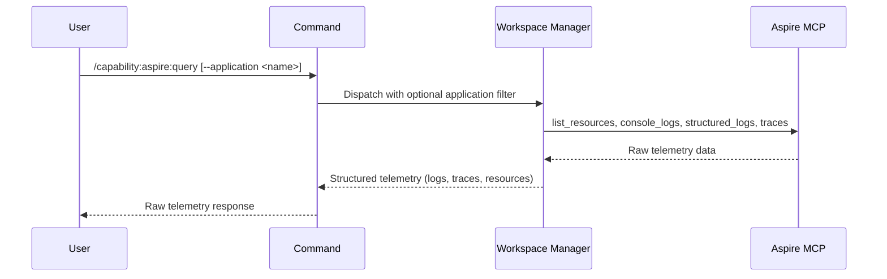

## PURPOSE

Query Aspire AppHost MCP for raw telemetry data — retrieve console logs, structured logs, traces, and resource metadata. Returns unprocessed data for analysis in higher layers.

## EXECUTION

1. **List Resources** — Discover all running resources in Aspire AppHost; filter by `--application` if set
   - Collect resource names, types, and status

2. **Collect Telemetry** — For each resource: console logs, structured logs, traces, trace logs
   - Preserve raw log output without filtering or severity categorization
   - Maintain timestamps and resource context

3. **Return Raw Data** — Compile telemetry data and resource metadata without analysis or formatting

## DELEGATION

**MANDATORY**: Always invoke the agents defined in this command's frontmatter for their designated responsibilities. Never skip, replace, or simulate their behavior directly.

- `zzaia-workspace-manager` — Query Aspire MCP and retrieve raw telemetry data

## WORKFLOW



## ACCEPTANCE CRITERIA

- Connects to Aspire AppHost MCP
- Lists all resources (or filters to single application if specified)
- Retrieves console logs, structured logs, traces for each resource
- Returns raw unprocessed data without analysis or grouping
- Timestamps preserved for all events
- Resource metadata included (name, type, status)

## EXAMPLES

```
/capability:aspire:query
```

```
/capability:aspire:query --application order-service
```

```
/capability:aspire:query --application api-gateway --description "Retrieve recent traces for performance analysis"
```

## OUTPUT

- **Resource List**: Name, type, status for all discovered resources
- **Console Logs**: Raw console output per resource with timestamps
- **Structured Logs**: Structured log entries with fields and severity
- **Traces**: Trace data and trace logs from running services
- **Metadata**: Resource properties and runtime context
