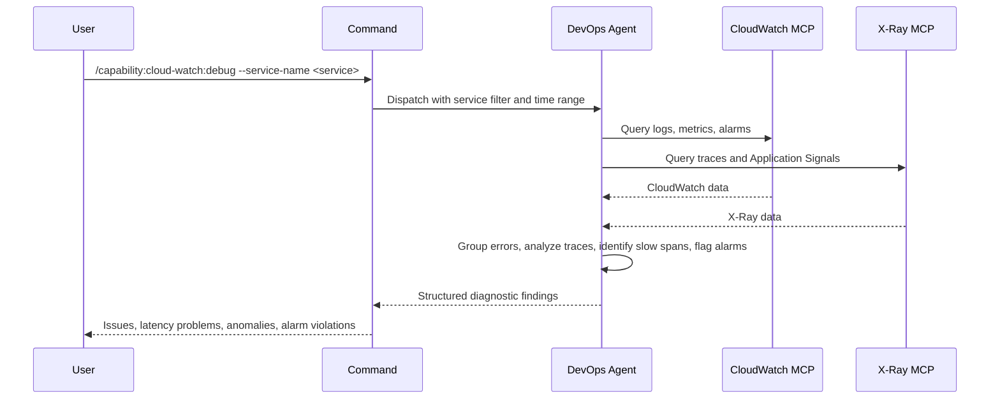

## PURPOSE

Retrieve and analyze AWS CloudWatch and X-Ray telemetry for a service. Surfaces errors, latency issues, trace anomalies, alarm violations, and quality problems. Returns structured diagnostic findings — not raw data.

## EXECUTION

1. **Retrieve Telemetry** — Call `/capability:cloud-watch:query --service-name <service-name> --time-range <time-range>`
   - CloudWatch logs and metrics
   - CloudWatch alarms and states
   - X-Ray traces and Application Signals
   - Trace segments and service nodes

2. **Analyze — Runtime Issues**
   - Group errors by type and message; calculate frequency
   - Identify failed traces and root cause services
   - Flag alarms in ALARM or INSUFFICIENT_DATA states
   - Map occurrences to timeline

3. **Analyze — Quality Issues**
   - Detect error rate exceeding acceptable threshold (> 1% of requests)
   - Flag SLA violations: trace latency above defined targets
   - Identify throughput degradation trends across the time range
   - Surface slow spans in traces and bottleneck services
   - Flag alarm violations and metric threshold breaches

4. **Return Findings** — Structured diagnostic output with severity-tagged issues and quality violations

## DELEGATION

**MANDATORY**: Always invoke the agents defined in this command's frontmatter for their designated responsibilities. Never skip, replace, or simulate their behavior directly.

- `zzaia-devops-specialist` — Query CloudWatch and X-Ray MCPs and analyze diagnostic data

## WORKFLOW



## ACCEPTANCE CRITERIA

- Telemetry retrieved for the specified time range from both MCPs
- Errors deduplicated and grouped by type with frequency
- Failed traces identified with root cause services
- Alarms in ALARM state flagged with severity
- Slow spans and latency issues identified in traces
- Quality violations identified: error rate, SLA breaches, throughput degradation, alarm violations
- Timestamps included for all critical events

## EXAMPLES

```
/capability:cloud-watch:debug --service-name payment-service
```

```
/capability:cloud-watch:debug --service-name api-gateway --time-range 48
```

```
/capability:cloud-watch:debug --service-name lambda-processor --time-range 12 --description "Check for timeout issues"
```

## OUTPUT

- **Issues**: Error types, frequency, affected services
- **Traces**: Failed traces with root cause analysis
- **Latency**: Slow spans, bottleneck services, SLA violations
- **Alarms**: Active alarms with threshold and state
- **Anomalies**: Detected trace anomalies and deviations
- **Performance**: Request latency, throughput, error rate trends
- **Quality Violations**: Error rate threshold breaches, SLA violations, throughput degradation, alarm violations
- **Timeline**: Chronological summary of key events
