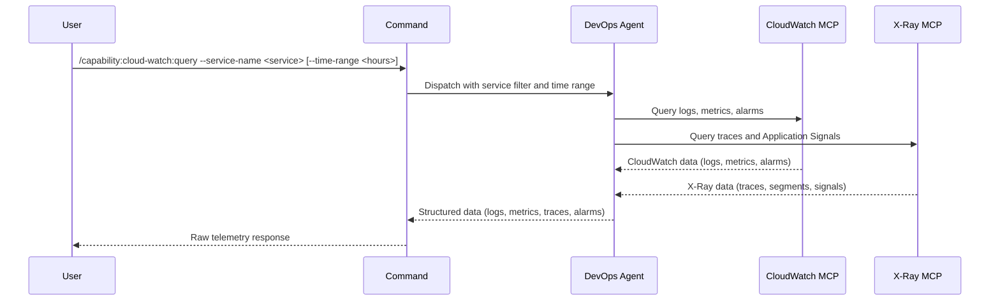

## PURPOSE

Query AWS CloudWatch and X-Ray MCPs for raw telemetry data — retrieve logs, metrics, alarms, and distributed traces. Returns structured unprocessed data for analysis in higher layers.

## EXECUTION

1. **Query CloudWatch & X-Ray** — Retrieve data for `--service-name` from the last `--time-range` hours (default 24h)
   - CloudWatch logs from log groups
   - CloudWatch metrics and alarms
   - X-Ray traces and Application Signals
   - Trace segments and service nodes

2. **Return Raw Data** — Compile structured telemetry data without analysis or formatting

## DELEGATION

**MANDATORY**: Always invoke the agents defined in this command's frontmatter for their designated responsibilities. Never skip, replace, or simulate their behavior directly.

- `zzaia-devops-specialist` — Query aws-cloudwatch and aws-cloudwatch-xray MCP tools and retrieve raw telemetry data

## WORKFLOW



## ACCEPTANCE CRITERIA

- Connects to CloudWatch MCP with provided service name
- Connects to X-Ray MCP and retrieves traces
- Retrieves logs, metrics, alarms, and traces from specified time range
- Returns raw structured data without analysis
- Timestamps preserved for all events
- Data organized by category (logs, metrics, traces, alarms)

## EXAMPLES

```
/capability:cloud-watch:query --service-name payment-service
```

```
/capability:cloud-watch:query --service-name api-gateway --time-range 48
```

```
/capability:cloud-watch:query --service-name worker-service --time-range 12 --description "Check for recent lambda errors"
```

## OUTPUT

- **Logs**: CloudWatch log entries from log groups
- **Metrics**: CloudWatch metrics and statistics
- **Alarms**: Active alarms with state and thresholds
- **Traces**: X-Ray traces with latency and error data
- **Application Signals**: Service health and performance signals
- **Timestamps**: Event timestamps for correlation and analysis
