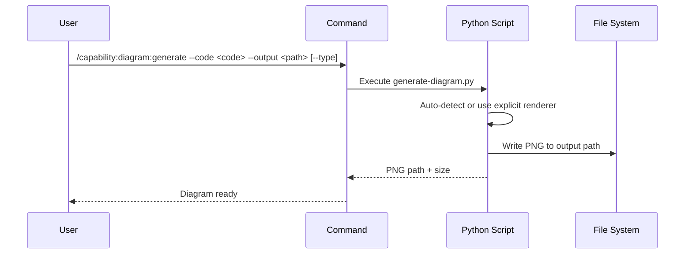

## PURPOSE

Render a diagram from Mermaid, Graphviz, D2, PlantUML, or Python `diagrams` source code to a PNG file using local renderers — no internet access required.

## RENDERERS

| Type | CLI Tool | Auto-detected By | Best For | When to Use |
|---|---|---|---|---|
| `mermaid` | `mmdc` (npm) | `graph`, `sequenceDiagram`, `C4Context`, etc. | Sequence, flowcharts, simple C4 | Quick inline diagrams in markdown/docs; sequence flows; already in markdown |
| `graphviz` | `dot` (graphviz) | `digraph`, `graph {`, `strict digraph` | General graphs, dependency trees | When `splines=ortho` edge routing or precise DOT control is needed |
| `d2` | `d2` CLI | explicit `--type d2` only | **Architecture diagrams — cleanest layout** | **Default choice for service/container architecture diagrams** |
| `plantuml` | `plantuml` CLI | `@startuml` | **Full C4 model with Person/System icons** | When formal C4 notation with icons is required (C4Context, C4Container) |
| `diagrams` | `python3` + `diagrams` pkg | `from diagrams import`, `from diagrams.` | **Cloud infra with AWS/Azure/GCP icons** | **AWS, Azure, GCP, Kubernetes infrastructure visualization** |

## EXECUTION

1. **Detect Renderer**: Use `--type` or auto-detect from code syntax
2. **Generate PNG**: Run `./scripts/generate-diagram.py <code> <output> [type]`
3. **Return Path**: Confirm PNG written to `--output`

**D2 note**: uses `--layout=elk` by default for minimal edge crossings.

## DELEGATION

**MANDATORY**: Always invoke the agents defined in this command's frontmatter.

- `zzaia-document-specialist` — Executes diagram generation workflow

## WORKFLOW



## EXAMPLES

```
# Mermaid — quick inline sequence/flowchart (auto-detected)
/capability:diagram:generate --code "graph TD\n A --> B --> C" --output ./diagrams/flow.png

# Graphviz — dependency trees, graph analysis, splines=ortho routing
/capability:diagram:generate --type graphviz --code "digraph { rankdir=TB; splines=ortho; A -> B -> C }" --output ./diagrams/arch.png

# D2 + ELK — default choice for service/container architecture diagrams
/capability:diagram:generate --type d2 --code "direction: down\nwasm -> bff: GraphQL\nbff -> order: HTTP/Dapr\nbff -> identity: HTTP/Dapr" --output ./diagrams/arch.png

# PlantUML — formal C4 model with Person/System/Container icons
/capability:diagram:generate --type plantuml --code "@startuml\n!include C4Container.puml\nPerson(u, \"User\")\nSystem(s, \"System\")\nRel(u, s, \"Uses\")\n@enduml" --output ./diagrams/c4.png

# Diagrams (Python) — AWS/Azure/GCP/Kubernetes cloud infrastructure with provider icons
/capability:diagram:generate --type diagrams --code "from diagrams import Diagram, Cluster\nfrom diagrams.azure.compute import AppService\nfrom diagrams.azure.database import SQLDatabase\nwith Diagram('CoffeeShop'):\n    with Cluster('Services'):\n        svc = AppService('Order')\n    db = SQLDatabase('PostgreSQL')\n    svc >> db" --output ./diagrams/infra.png
```

## OUTPUT

- PNG file at `--output` path
- Confirmation message with renderer used and file size
