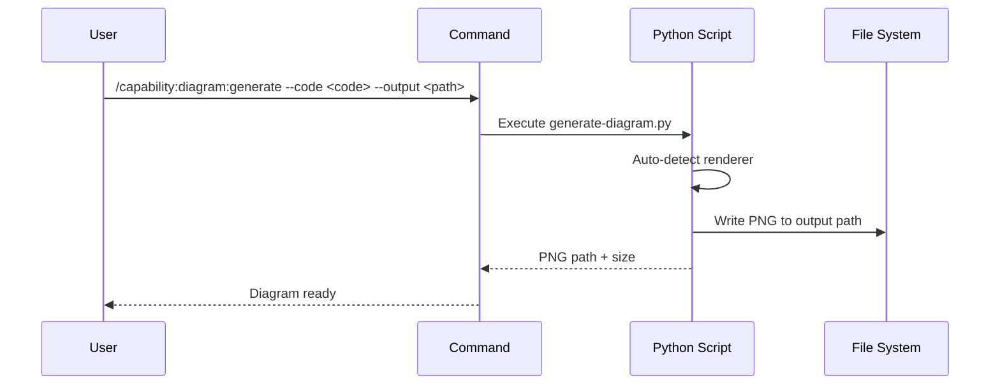

## PURPOSE

Render a diagram from Mermaid or Graphviz source code to a PNG file using local renderers — no internet access required.

## EXECUTION

1. **Detect Renderer**: Use `--type` or auto-detect from code syntax
   - Mermaid keywords (`graph`, `sequenceDiagram`, `C4Context`, `erDiagram`, etc.) → `mmdc`
   - Graphviz keywords (`digraph`, `graph {`) → `graphviz`

2. **Generate PNG**: Run `./scripts/generate-diagram.py`

3. **Return Path**: Confirm PNG written to `--output`

## DELEGATION

**MANDATORY**: Always invoke the agents defined in this command's frontmatter.

- `zzaia-document-specialist` — Executes diagram generation workflow

## WORKFLOW



## EXAMPLES

```
/capability:diagram:generate --code "graph TD\n A --> B --> C" --output ./diagrams/flow.png
/capability:diagram:generate --code "sequenceDiagram\n  A->>B: Hello" --output ./diagrams/seq.png
/capability:diagram:generate --type graphviz --code "digraph { A -> B -> C }" --output ./diagrams/arch.png
```

## OUTPUT

- PNG file at `--output` path
- Confirmation message with renderer used and file size
