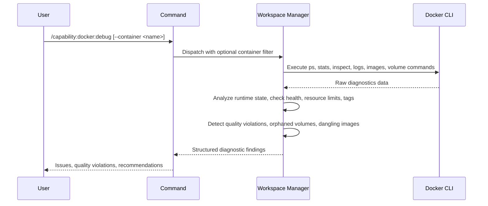

## PURPOSE

Retrieve and analyze Docker environment state. Surfaces runtime issues (stopped/crashed containers, unhealthy state, OOM kills, restart loops) and quality violations (containers running as root, exposed ports without intent, missing health checks, latest tag usage, missing resource limits, orphaned volumes, dangling images). Returns structured diagnostic findings — not raw data.

## EXECUTION

1. **Gather Diagnostics** — Execute Docker CLI commands
   - `docker ps -a` — container state
   - `docker stats --no-stream` — resource usage and OOM status
   - `docker inspect <container>` — container metadata (if `--container` specified)
   - `docker logs --tail 100 <container>` — recent logs (if `--container` specified)
   - `docker images` — image metadata including tags
   - `docker volume ls` — volume state
   - Container health checks via inspect

2. **Analyze — Runtime Issues**
   - Identify stopped or crashed containers (status != running)
   - Flag unhealthy containers (Health check failed)
   - Detect OOM kills and restart loops (RestartCount, OOMKilled flag)
   - Check container logs for error patterns or crash indicators
   - Alert on containers not reached healthy state within timeout period

3. **Analyze — Quality Issues**
   - Flag containers running as `root` (User field empty or "0")
   - Identify exposed ports without explicit binding intent
   - Surface missing health checks on long-running containers
   - Detect images using `latest` tag instead of explicit versions
   - Identify containers without CPU or memory limits set
   - Report orphaned volumes (not mounted to any container)
   - Flag dangling images (no reference from any container)

4. **Return Findings** — Structured diagnostic output with severity-tagged issues and quality violations

## DELEGATION

**MANDATORY**: Always invoke the agents defined in this command's frontmatter for their designated responsibilities. Never skip, replace, or simulate their behavior directly.

- `zzaia-workspace-manager` — Execute Docker CLI commands and analyze environment state

## WORKFLOW



## ACCEPTANCE CRITERIA

- Container state retrieved and analyzed
- Runtime issues identified: stopped/crashed, unhealthy, OOM, restart loops
- Quality issues detected: root execution, missing health checks, latest tags, no resource limits
- Orphaned volumes and dangling images reported
- Severity-tagged findings (critical, warning, info)
- Container-specific analysis if `--container` provided
- Log excerpt included for crashed/unhealthy containers

## EXAMPLES

```
/capability:docker:debug
```

```
/capability:docker:debug --container my-app
```

```
/capability:docker:debug --description "Check for production readiness violations"
```

## OUTPUT

- **Runtime Issues**: Stopped/crashed containers, unhealthy status, OOM events, restart loops
- **Quality Violations**: Root execution, missing health checks, latest tag usage, missing resource limits
- **Volume Analysis**: Orphaned volumes, dangling images
- **Log Snippets**: Recent error indicators from targeted containers
- **Overall Assessment**: Docker environment health and readiness level
