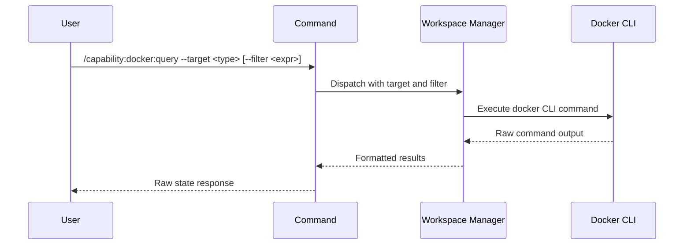

## PURPOSE

Retrieve raw Docker state via CLI. Returns unprocessed output from Docker commands — container list, image list, volume list, or network list. No formatting or analysis applied.

## EXECUTION

1. **Identify Target** — Parse `--target` and invoke appropriate Docker CLI command
   - `containers` → `docker ps -a` with optional `--filter`
   - `images` → `docker images` with optional `--filter`
   - `volumes` → `docker volume ls` with optional `--filter`
   - `networks` → `docker network ls` with optional `--filter`

2. **Apply Filter** — If `--filter` provided, append as Docker filter syntax

3. **Return Raw Results** — Compile CLI output without processing, transformation, or analysis

## DELEGATION

**MANDATORY**: Always invoke the agents defined in this command's frontmatter for their designated responsibilities. Never skip, replace, or simulate their behavior directly.

- `zzaia-workspace-manager` — Execute Docker CLI commands and retrieve raw state

## WORKFLOW



## ACCEPTANCE CRITERIA

- Executes correct Docker CLI command per `--target`
- Applies filter expression if provided
- Returns raw command output
- Preserves field formatting and column data
- Includes all available columns for the resource type
- Errors reported with target context

## EXAMPLES

```
/capability:docker:query --target containers
```

```
/capability:docker:query --target containers --filter status=exited
```

```
/capability:docker:query --target images --description "List all images including dangling"
```

```
/capability:docker:query --target volumes --filter dangling=true
```

## OUTPUT

- **Raw CLI Output**: Unformatted command results with standard Docker columns
- **Resource List**: All requested resources matching filter criteria
- **Metadata**: Column headers and formatting as returned by Docker
