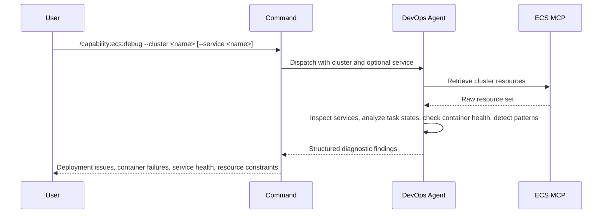

## PURPOSE

Retrieve and analyze ECS cluster resources. Surfaces deployment failures, service health issues, container failures, and task state anomalies. Returns structured diagnostic findings — not raw data.

## EXECUTION

1. **Retrieve Resources** — Call `/capability:ecs:query --cluster <cluster> --resource all`

2. **Analyze — Deployment Issues**
   - Identify services with 0 running tasks while desired > 0
   - Flag services where running task count < desired task count
   - Detect recent deployment failures or rollback patterns
   - Check task definition update failures and constraint violations
   - Surface image pull failures or ECR access issues

3. **Analyze — Container Health**
   - Identify tasks in STOPPED state and capture exit codes
   - Flag tasks with health check failures
   - Detect container crashed or exited unexpectedly patterns
   - Check for memory/CPU pressure or resource constraint violations
   - Surface container dependency or startup order issues

4. **Return Findings** — Structured diagnostic output with severity-tagged issues and health violations

## DELEGATION

**MANDATORY**: Always invoke the agents defined in this command's frontmatter for their designated responsibilities. Never skip, replace, or simulate their behavior directly.

- `zzaia-devops-specialist` — Query ECS MCP and analyze cluster state

## WORKFLOW



## ACCEPTANCE CRITERIA

- Resources retrieved from specified cluster
- Services with task count mismatches identified
- Tasks in stopped/failed state reported with exit codes
- Deployment failures and rollback patterns detected
- Health check failures flagged with container context
- Image pull and ECR access issues surfaced
- Resource constraint violations and pressure conditions identified

## EXAMPLES

```
/capability:ecs:debug --cluster production
```

```
/capability:ecs:debug --cluster staging --service api-service
```

## OUTPUT

- **Service Health Issues**: Services with 0 running tasks, desired vs running mismatch
- **Deployment Failures**: Recent failures, rollback patterns, constraint violations
- **Container Failures**: Stopped tasks with exit codes, crashes, health check failures
- **Resource Issues**: Memory/CPU pressure, constraint violations, image pull errors
- **Cluster Health**: Overall deployment stability and service readiness
