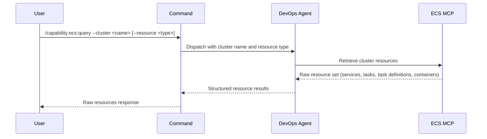

## PURPOSE

Retrieve raw ECS cluster resources via MCP. Returns unprocessed data — services, tasks, task definitions, and container details. No formatting or analysis applied.

## EXECUTION

1. **Retrieve Resources** — Query the specified `--cluster` for resources of type `--resource` (default all)
   - List services with status and task counts
   - List tasks with state and container information
   - List task definitions with revisions and container specs
   - Include container image references and ECR details
   - Preserve all resource attributes and metadata

2. **Return Raw Results** — Compile resource output without processing, transformation, or analysis

## DELEGATION

**MANDATORY**: Always invoke the agents defined in this command's frontmatter for their designated responsibilities. Never skip, replace, or simulate their behavior directly.

- `zzaia-devops-specialist` — Query ECS MCP and retrieve cluster resources

## WORKFLOW



## ACCEPTANCE CRITERIA

- Connects to ECS via MCP with specified cluster name or ARN
- Retrieves requested resource types (services, tasks, task definitions, or all)
- Returns raw service status, task state, task definition specs
- Includes container image references and ECR paths
- Preserves all resource attributes and deployment metadata
- Errors reported with cluster context

## EXAMPLES

```
/capability:ecs:query --cluster production
```

```
/capability:ecs:query --cluster staging --resource services
```

```
/capability:ecs:query --cluster my-cluster --resource tasks --description "Check for running tasks"
```

## OUTPUT

- **Services**: Service name, status, desired and running task counts, deployment info
- **Tasks**: Task ID, state, launch type, container details and exit codes
- **Task Definitions**: Family, revision, container specifications, CPU/memory
- **Containers**: Image URI, environment variables, port mappings, health checks
- **Metadata**: Cluster stats and retrieval context
