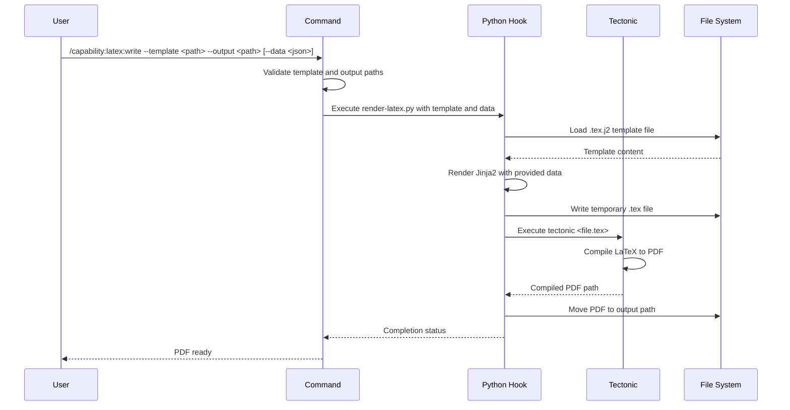

## PURPOSE

Compile LaTeX documents to PDF using the tectonic engine. Accepts a Jinja2-templated `.tex.j2` file, auto-generates diagrams from Mermaid/Graphviz code in `--data`, renders the template, and produces a PDF output file.

## EXECUTION

1. **Validate Input**: Check template path and output directory

   - Verify template file exists and has `.tex.j2` extension
   - Verify output directory is writable
   - Parse JSON data if provided

2. **Auto-generate Diagrams**: Scan `--data` for `diagram_*` keys containing diagram code

   - Keys starting with `diagram_` whose value is Mermaid or Graphviz source are auto-rendered to PNG
   - PNGs are saved to `<output_dir>/diagrams/`
   - The key value is replaced with the PNG path before template rendering
   - Keys already containing file paths (`.png`, `/path/to/file`) are passed through unchanged

3. **Render Template**: Run `./scripts/render-latex.py` to process Jinja2 template

   - Load `.tex.j2` template file
   - Render with resolved data (diagram keys now contain PNG paths)
   - Write temporary `.tex` file to workspace

4. **Compile with Tectonic**: Execute tectonic CLI engine

   - Run `tectonic` on rendered `.tex` file
   - Capture compilation output and errors
   - Handle missing or invalid LaTeX syntax

4. **Deliver Output**: Move compiled PDF to requested output path

   - Verify PDF was generated successfully
   - Copy to `--output` location
   - Clean up temporary files

## DELEGATION

**MANDATORY**: Always invoke the agents defined in this command's frontmatter for their designated responsibilities. Never skip, replace, or simulate their behavior directly.

- `zzaia-document-specialist` — Manage template rendering and PDF generation workflow

## WORKFLOW



## ACCEPTANCE CRITERIA

- Accepts `.tex.j2` Jinja2-templated LaTeX files
- Renders template with JSON-provided variables
- Compiles LaTeX to PDF using tectonic CLI
- Delivers PDF to specified output path
- Handles missing template files with clear error messages
- Handles invalid JSON data with format guidance
- Handles tectonic compilation errors with meaningful output
- Cleans up temporary files after successful compilation
- Reports missing tectonic dependency with installation instructions

## EXAMPLES

```
/capability:latex:write --template ./templates/document.tex.j2 --output ~/report.pdf --data '{"title":"My Report","author":"John Doe"}'
/capability:latex:write --template /absolute/path/template.tex.j2 --output ./output/document.pdf
```

## OUTPUT

- PDF file at specified `--output` path
- Compilation status and any LaTeX warnings or errors
- Temporary `.tex` file removed after successful compilation
