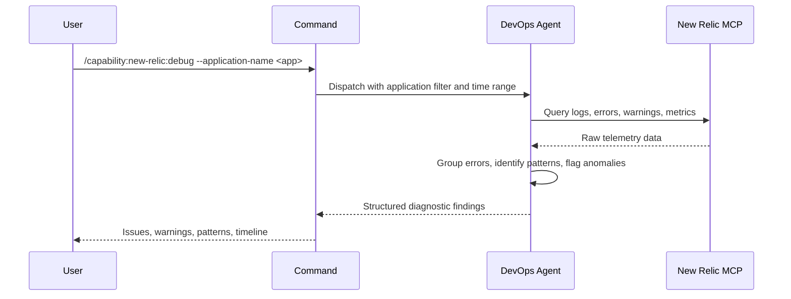

## PURPOSE

Retrieve and analyze New Relic telemetry for an application. Surfaces errors, warnings, anomalies, performance issues, and quality violations. Returns structured diagnostic findings — not raw data.

## EXECUTION

1. **Retrieve Telemetry** — Call `/capability:new-relic:query --application-name <application-name> --time-range <time-range>`
   - Error logs and stack traces
   - Warning events
   - Anomalies
   - Transaction performance metrics

2. **Analyze — Runtime Issues**
   - Group errors by type and root cause; calculate frequency
   - Identify warning trends and recurrence patterns
   - Flag anomalies and performance deviations
   - Map occurrences to timeline

3. **Analyze — Quality Issues**
   - Detect error rate exceeding acceptable threshold (> 1% of transactions)
   - Flag SLA violations: response times above defined latency targets
   - Identify throughput degradation trends across the time range
   - Surface repeated error patterns indicating systemic code quality problems (e.g. unhandled exceptions, null reference errors, serialization failures)
   - Flag missing or incomplete instrumentation (gaps in trace coverage)

4. **Return Findings** — Structured diagnostic output with severity-tagged issues and quality violations

## DELEGATION

**MANDATORY**: Always invoke the agents defined in this command's frontmatter for their designated responsibilities. Never skip, replace, or simulate their behavior directly.

- `zzaia-devops-specialist` — Query New Relic MCP and analyze diagnostic data

## WORKFLOW



## ACCEPTANCE CRITERIA

- Telemetry retrieved for the specified time range
- Errors deduplicated and grouped by root cause with frequency
- Warnings identified with recurrence trends
- Anomalies flagged with context
- Quality violations identified: error rate, SLA breaches, throughput degradation, systemic error patterns
- Timestamps included for all critical events

## EXAMPLES

```
/capability:new-relic:debug --application-name payment-service
```

```
/capability:new-relic:debug --application-name api-gateway --time-range 48
```

## OUTPUT

- **Issues**: Error types, frequency, stack traces
- **Warnings**: Recurring warning events with timestamps
- **Anomalies**: Detected deviations and their context
- **Performance**: Transaction latency, throughput, error rate trends
- **Quality Violations**: Error rate threshold breaches, SLA violations, throughput degradation, systemic error patterns
- **Timeline**: Chronological summary of key events
