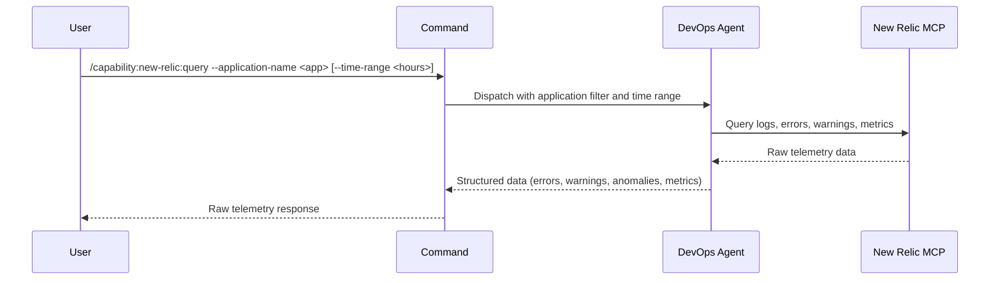

## PURPOSE

Query New Relic MCP for raw telemetry data — retrieve error logs, stack traces, warning events, anomalies, and transaction performance metrics. Returns structured unprocessed data for analysis in higher layers.

## EXECUTION

1. **Query New Relic** — Retrieve logs filtered by `--application-name` from the last `--time-range` hours (default 24h)
   - Error logs and stack traces
   - Warning events
   - Anomalies
   - Transaction performance metrics

2. **Return Raw Data** — Compile structured telemetry data without analysis or formatting

## DELEGATION

**MANDATORY**: Always invoke the agents defined in this command's frontmatter for their designated responsibilities. Never skip, replace, or simulate their behavior directly.

- `zzaia-devops-specialist` — Query New Relic MCP tools and retrieve raw telemetry data

## WORKFLOW



## ACCEPTANCE CRITERIA

- Connects to New Relic MCP with provided application name
- Retrieves logs, errors, warnings, anomalies, and metrics from specified time range
- Returns raw structured data without analysis
- Timestamps preserved for all events
- Data organized by category (errors, warnings, anomalies, metrics)

## EXAMPLES

```
/capability:new-relic:query --application-name payment-service
```

```
/capability:new-relic:query --application-name api-gateway --time-range 48
```

```
/capability:new-relic:query --application-name worker-service --time-range 12 --description "Check for recent memory anomalies"
```

## OUTPUT

- **Errors**: Error logs, stack traces, error types
- **Warnings**: Warning events with timestamps and severity
- **Anomalies**: Detected anomalies and deviations
- **Metrics**: Transaction performance data (latency, throughput, error rates)
- **Timestamps**: Event timestamps for correlation and analysis
