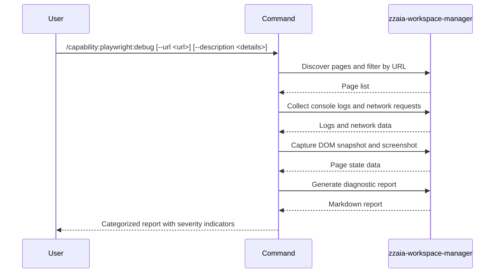

## PURPOSE

Diagnose active Playwright browser sessions by collecting console logs, network errors, and page state. Generate a severity-categorized issue report grouped by page URL, with indicators for errors, warnings, blocked requests, and accessibility issues.

## EXAMPLES

```
/capability:playwright:debug
```

```
/capability:playwright:debug --url https://example.com/login
```

```
/capability:playwright:debug --description "Focus on authentication flow errors"
```

## EXECUTION

1. **Discover Pages** — List open browser tabs; filter by `--url` if set
2. **Collect Console Logs** — Retrieve console messages; separate errors, warnings, info
3. **Collect Network Requests** — Retrieve all requests; flag 4xx/5xx and blocked
4. **Capture Page State** — DOM/accessibility snapshot and screenshot
5. **Report** — Categorize by severity; group by page URL; output markdown report

## DELEGATION

**MANDATORY**: Always invoke the agents defined in this command's frontmatter for their designated responsibilities. Never skip, replace, or simulate their behavior directly.

- `zzaia-workspace-manager` — Executes all Playwright MCP tool calls and generates the diagnostic report

## WORKFLOW



## ACCEPTANCE CRITERIA

- Read-only — no writes, no state changes
- Handles optional `--url` filter
- Report grouped by page URL with severity indicators (❌ ⚠️ 🔴 🚫)
- Optional `--description` parameter narrows focus
- Markdown output with clear categorization

## OUTPUT

Markdown diagnostic report containing:
- Console logs (errors, warnings, info separated)
- Network requests (4xx/5xx flagged, blocked requests highlighted)
- Page state snapshots
- Accessibility issues
- Severity-grouped by page URL
