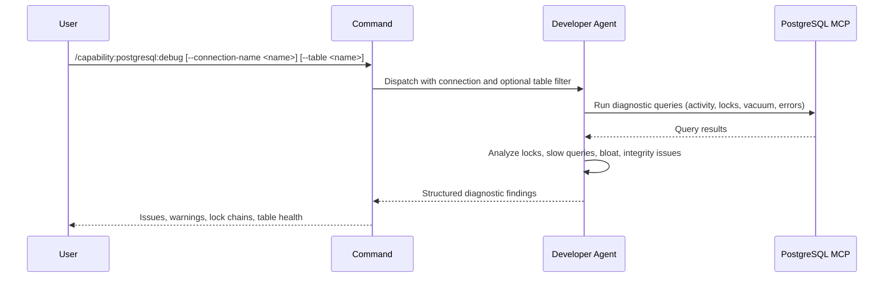

## PURPOSE

Run automated diagnostic queries against PostgreSQL and analyze results. Surfaces active locks, long-running queries, connection saturation, data inconsistencies, and quality violations. Returns structured diagnostic findings — not raw data.

## EXECUTION

1. **Run Diagnostic Queries** — Execute standard health-check SQL against `--connection-name` (or default):
   - Active and idle connections: `pg_stat_activity`
   - Lock contention: `pg_locks` joined with `pg_stat_activity`
   - Long-running queries (> 5s): `pg_stat_activity WHERE state != 'idle' AND query_start < NOW() - INTERVAL '5s'`
   - Table bloat and vacuum status: `pg_stat_user_tables` (filtered to `--table` if set)
   - Index usage: `pg_stat_user_indexes` for unused or low-efficiency indexes
   - Recent errors from `pg_stat_bgwriter` and replication lag if applicable

2. **Analyze — Runtime Issues**
   - Identify blocked or waiting queries
   - Flag lock contention chains
   - Detect connection pool saturation
   - Surface tables with high dead tuple ratios (vacuum needed)

3. **Analyze — Quality Issues**
   - Detect constraint violations or integrity errors (foreign key, unique, not-null breaches)
   - Identify orphaned records (rows referencing deleted parent records without cascade)
   - Flag unused indexes consuming storage without benefit
   - Surface sequential scans on large tables indicating missing indexes
   - Detect NULL values in columns expected to be non-null (when `--table` specified)
   - Identify data type mismatches or implicit casting in frequent queries

4. **Return Findings** — Structured diagnostic output with severity-tagged issues and quality violations

## DELEGATION

**MANDATORY**: Always invoke the agents defined in this command's frontmatter for their designated responsibilities. Never skip, replace, or simulate their behavior directly.

- `zzaia-developer-specialist` — Execute diagnostic SQL via PostgreSQL MCP and analyze results

## WORKFLOW



## ACCEPTANCE CRITERIA

- Diagnostic queries executed against specified connection
- Active locks and blocked queries identified
- Long-running queries surfaced with duration and query text
- Connection saturation assessed
- Quality violations identified: constraint breaches, orphaned records, unused indexes, sequential scans on large tables, null anomalies
- Table-level issues reported when `--table` is specified

## EXAMPLES

```
/capability:postgresql:debug
```

```
/capability:postgresql:debug --connection-name analytics-db
```

```
/capability:postgresql:debug --table orders --description "Check for data integrity issues after migration"
```

## OUTPUT

- **Locks**: Blocked queries and lock contention chains
- **Slow Queries**: Long-running queries with duration and text
- **Connections**: Active/idle counts and saturation risk
- **Table Health**: Dead tuple ratio, last vacuum, bloat estimate (filtered to `--table` if set)
- **Quality Violations**: Constraint breaches, orphaned records, unused indexes, sequential scans on large tables, null anomalies, casting issues
- **Integrity Issues**: Constraint violations or data anomalies (when `--table` specified)
