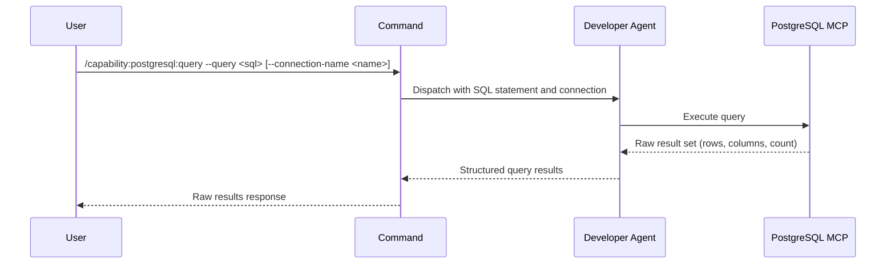

## PURPOSE

Execute raw SQL queries against PostgreSQL database via MCP. Returns unprocessed query results — rows, columns, and row count. No formatting or analysis applied.

## EXECUTION

1. **Execute SQL** — Run the provided `--query` against the specified `--connection-name` (or default if omitted)
   - Retrieve all result rows
   - Preserve column information
   - Include row count

2. **Return Raw Results** — Compile query output without processing, transformation, or analysis

## DELEGATION

**MANDATORY**: Always invoke the agents defined in this command's frontmatter for their designated responsibilities. Never skip, replace, or simulate their behavior directly.

- `zzaia-developer-specialist` — Execute SQL queries via PostgreSQL MCP and retrieve raw results

## WORKFLOW



## ACCEPTANCE CRITERIA

- Connects to PostgreSQL via MCP with specified connection
- Executes provided SQL statement exactly as given
- Returns raw result set without modification
- Preserves column names and data types
- Includes total row count
- Errors reported with SQL context

## EXAMPLES

```
/capability:postgresql:query --query "SELECT * FROM users WHERE status = 'active'"
```

```
/capability:postgresql:query --query "SELECT COUNT(*) as total FROM orders" --connection-name analytics-db
```

```
/capability:postgresql:query --query "SELECT id, email FROM customers LIMIT 10" --description "Fetch first 10 customer records"
```

## OUTPUT

- **Rows**: Query result set with all columns
- **Column Names**: Column identifiers and data types
- **Row Count**: Total number of rows returned
- **Metadata**: Query execution details (duration, rows affected)
