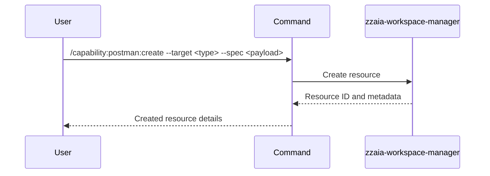

## PURPOSE

Create a new Postman resource (collection, request, environment, or mock). Supports full specification of resource properties.

## EXECUTION

1. **Identify** the resource type from `--target`
2. **Parse** the resource specification from `--spec`
3. **Create** the resource using Postman MCP
4. **Return** the created resource ID and metadata

## DELEGATION

**MANDATORY**: Always invoke the agents defined in this command's frontmatter for their designated responsibilities. Never skip, replace, or simulate their behavior directly.

- `zzaia-workspace-manager` — Create resource via Postman MCP

## WORKFLOW



## ACCEPTANCE CRITERIA

- Resource is created in Postman workspace
- Resource ID is returned
- All specified properties are applied
- Resource is accessible for subsequent operations

## EXAMPLES

```
/capability:postman:create --target collection --spec '{"name":"API Tests","description":"Test collection"}'
```

```
/capability:postman:create --target environment --spec '{"name":"staging","variables":{"api_url":"https://staging.example.com","api_key":"test_key"}}' --description "Create staging environment with base URL and API key"
```

```
/capability:postman:create --target request --spec '{"name":"Get Users","method":"GET","url":"{{api_url}}/users","headers":{"Authorization":"Bearer {{api_key}}"}}' --description "Create request for retrieving user list"
```

## OUTPUT

- Created resource ID
- Resource name and type
- Resource metadata and properties
