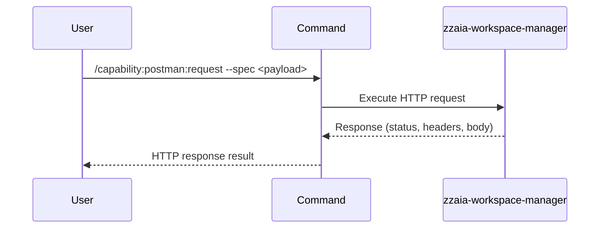

## PURPOSE

Execute an HTTP call via Postman runner. Sends requests with full support for methods, URLs, headers, and body payloads.

## EXECUTION

1. **Parse** the request specification from `--spec`
2. **Execute** the HTTP call using Postman MCP
3. **Return** the response with status, headers, and body

## DELEGATION

**MANDATORY**: Always invoke the agents defined in this command's frontmatter for their designated responsibilities. Never skip, replace, or simulate their behavior directly.

- `zzaia-workspace-manager` — Execute HTTP request via Postman runner

## WORKFLOW



## ACCEPTANCE CRITERIA

- HTTP request executes via Postman MCP
- Response includes status code, headers, and body
- Supports all HTTP methods (GET, POST, PUT, DELETE, PATCH, etc.)
- Handles request headers and body payload

## EXAMPLES

```
/capability:postman:request --spec '{"method":"GET","url":"https://api.example.com/data","headers":{"Authorization":"Bearer token"}}'
```

```
/capability:postman:request --spec '{"method":"POST","url":"https://api.example.com/data","headers":{"Content-Type":"application/json"},"body":{"name":"test"}}' --description "Create new user in test environment"
```

## OUTPUT

- HTTP response status code
- Response headers
- Response body
