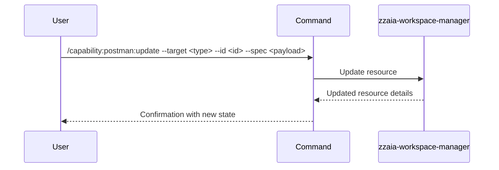

## PURPOSE

Update an existing Postman resource by ID or name. Supports partial or full updates of resource properties.

## EXECUTION

1. **Identify** the resource type from `--target` and resource ID from `--id`
2. **Parse** the updated specification from `--spec`
3. **Update** the resource using Postman MCP
4. **Return** the updated resource details

## DELEGATION

**MANDATORY**: Always invoke the agents defined in this command's frontmatter for their designated responsibilities. Never skip, replace, or simulate their behavior directly.

- `zzaia-workspace-manager` — Update resource via Postman MCP

## WORKFLOW



## ACCEPTANCE CRITERIA

- Resource is updated with specified properties
- Existing properties not in `--spec` are preserved
- Updated resource is immediately usable
- Update is reflected in Postman workspace

## EXAMPLES

```
/capability:postman:update --target collection --id "collection-abc123" --spec '{"name":"Updated Tests","description":"New description"}'
```

```
/capability:postman:update --target environment --id "staging" --spec '{"variables":{"api_key":"new_token"}}' --description "Rotate API key in staging environment"
```

```
/capability:postman:update --target request --id "Get Users" --spec '{"url":"{{api_url}}/v2/users"}' --description "Update endpoint to v2 API"
```

## OUTPUT

- Updated resource ID
- Resource name and type
- Updated resource metadata and properties
