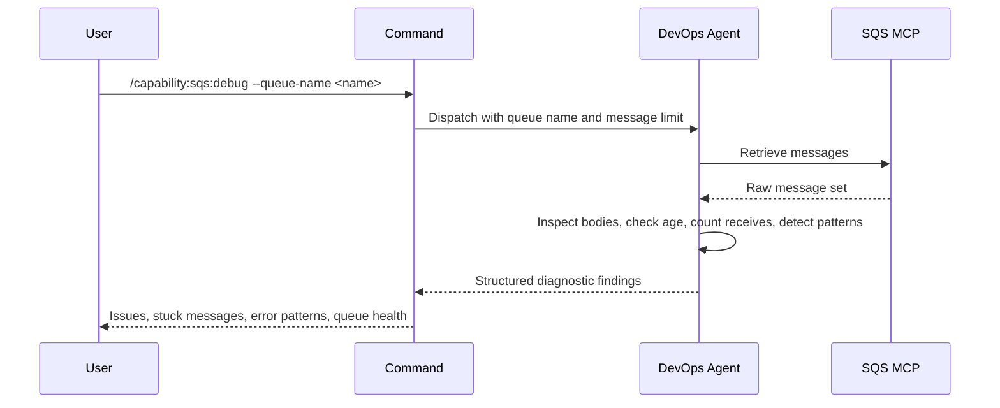

## PURPOSE

Retrieve and analyze SQS queue messages. Surfaces stuck messages, error patterns, delivery failures, queue health issues, and quality violations. Returns structured diagnostic findings — not raw data.

## EXECUTION

1. **Retrieve Messages** — Call `/capability:sqs:query --queue-name <queue-name> --max-messages <max-messages>`

2. **Analyze — Runtime Issues**
   - Inspect message bodies for error indicators, exception payloads, or failure markers
   - Identify stuck or aged messages (high `ApproximateFirstReceiveTimestamp` delta)
   - Check receive count for messages approaching or exceeding the dead-letter threshold
   - Flag malformed or unexpected message formats
   - Detect patterns across multiple messages (repeated error types, common failure payloads)

3. **Analyze — Quality Issues**
   - Flag messages with missing required fields or schema violations
   - Detect duplicate message IDs or idempotency key collisions
   - Identify messages with invalid or inconsistent payload structure (unexpected null values, type mismatches)
   - Surface high dead-letter candidate ratio as a processing quality signal
   - Flag visibility timeout misconfigurations (messages reappearing faster than expected processing time)

4. **Return Findings** — Structured diagnostic output with severity-tagged issues and quality violations

## DELEGATION

**MANDATORY**: Always invoke the agents defined in this command's frontmatter for their designated responsibilities. Never skip, replace, or simulate their behavior directly.

- `zzaia-devops-specialist` — Query SQS MCP and analyze queue state

## WORKFLOW



## ACCEPTANCE CRITERIA

- Messages retrieved from specified queue
- Stuck or aged messages identified
- Error patterns grouped by type across messages
- Dead-letter candidates flagged with receive count
- Malformed messages reported with context
- Quality violations identified: schema violations, duplicate IDs, payload inconsistencies, DLQ ratio, visibility timeout issues

## EXAMPLES

```
/capability:sqs:debug --queue-name orders-queue
```

```
/capability:sqs:debug --queue-name payments-queue --max-messages 20
```

## OUTPUT

- **Stuck Messages**: Messages with high age or excessive receive counts
- **Error Patterns**: Repeated error indicators grouped by type
- **Dead-Letter Candidates**: Messages near or over the retry threshold
- **Malformed Messages**: Unexpected or invalid message formats
- **Quality Violations**: Schema violations, duplicate IDs, payload inconsistencies, high DLQ ratio, visibility timeout misconfigs
- **Queue Health**: Overall assessment of queue state
