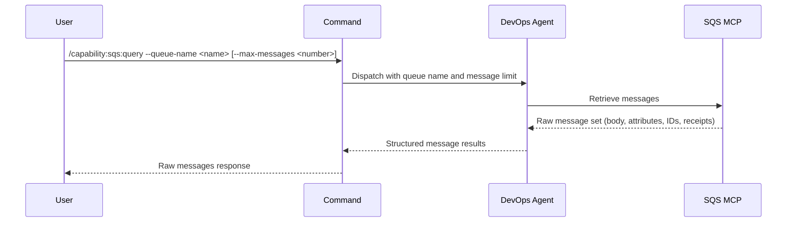

## PURPOSE

Retrieve raw messages from AWS SQS queue via MCP. Returns unprocessed message data — body, attributes, message ID, and receipt handle. No formatting or analysis applied.

## EXECUTION

1. **Retrieve Messages** — Query the specified `--queue-name` for up to `--max-messages` messages (default 10)
   - Fetch message body
   - Preserve all message attributes
   - Include message ID and receipt handle
   - Maintain attribute timestamps

2. **Return Raw Results** — Compile message output without processing, transformation, or analysis

## DELEGATION

**MANDATORY**: Always invoke the agents defined in this command's frontmatter for their designated responsibilities. Never skip, replace, or simulate their behavior directly.

- `zzaia-devops-specialist` — Query SQS MCP and retrieve raw messages

## WORKFLOW



## ACCEPTANCE CRITERIA

- Connects to SQS via MCP with specified queue name or URL
- Retrieves up to specified max messages (default 10)
- Returns raw message body, attributes, message ID, receipt handle
- Preserves message attribute types and values
- Includes visibility timeout and timestamp data
- Errors reported with queue context

## EXAMPLES

```
/capability:sqs:query --queue-name my-queue
```

```
/capability:sqs:query --queue-name https://sqs.us-east-1.amazonaws.com/123456789/my-queue --max-messages 20
```

```
/capability:sqs:query --queue-name process-queue --max-messages 5 --description "Check for pending processing tasks"
```

## OUTPUT

- **Message Body**: Raw message content
- **Message ID**: Unique message identifier
- **Receipt Handle**: Handle for message deletion or manipulation
- **Attributes**: Message attributes (type, timestamp, sender)
- **Metadata**: Queue stats and retrieval context
